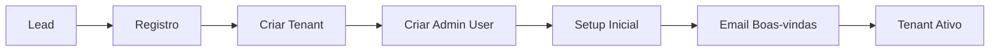

# 🏢 LogiFlow - Multi-Tenancy

Documentação completa do sistema Multi-Tenant do LogiFlow CRM.

---

## 📋 Visão Geral

O LogiFlow é uma aplicação **Multi-Tenant** onde cada cliente (transportadora) é um **tenant** isolado com seus próprios:
- Dados (entregas, cotações, motoristas, veículos)
- Usuários e permissões
- Credenciais de integrações (ERP, GPS, Frete)
- Configurações e customizações
- Plano e limites de uso

---

## 🔐 Arquitetura de Isolamento

### 1. **Resolução de Tenant**

O tenant é identificado automaticamente em cada requisição através de (prioridade):

1. **JWT Claim** `tenant_id` (Recomendado)
   ```json
   {
     "sub": "user@example.com",
     "tenant_id": 123,
     "role": "admin"
   }
   ```

2. **Subdomínio**
   ```
   acme.logiflow.com.br → Tenant "acme"
   ```

3. **Header HTTP** `X-Tenant-ID` (Fallback)
   ```http
   GET /api/v1/entregas
   X-Tenant-ID: 123
   ```

### 2. **Middleware de Tenant**

```python
# backend/middleware/tenant.py

class TenantMiddleware(BaseHTTPMiddleware):
    """
    - Resolve tenant em cada requisição
    - Valida se tenant existe e está ativo
    - Adiciona tenant_id ao request.state
    - Bloqueia acesso se tenant inválido
    """
```

**Rotas Isentas** (não requerem tenant):
- `/api/v1/auth/login`
- `/api/v1/auth/register`
- `/health`, `/ready`
- `/docs`, `/openapi.json`
- `/api/v1/tenants/` (criação de tenant)
- `/api/v1/leads/` (público)

### 3. **Isolamento de Dados**

Todas as tabelas do banco têm coluna `tenant_id`:

```sql
CREATE TABLE entregas (
    id INT PRIMARY KEY,
    tenant_id INT NOT NULL,
    codigo VARCHAR(50),
    status VARCHAR(50),
    -- outros campos
    INDEX idx_tenant_id (tenant_id),
    FOREIGN KEY (tenant_id) REFERENCES tenants(id) ON DELETE CASCADE
);
```

**Queries sempre incluem filtro de tenant**:

```python
# ❌ ERRADO - Sem filtro
entregas = db.query(Entrega).all()

# ✅ CORRETO - Com filtro
tenant_id = request.state.tenant_id
entregas = db.query(Entrega).filter(Entrega.tenant_id == tenant_id).all()
```

---

## 🛠️ Configuração e Setup

### 1. **Criar Tenant**

```http
POST /api/v1/tenants/
Content-Type: application/json

{
  "nome": "Transportadora ACME",
  "slug": "acme",
  "cnpj": "12.345.678/0001-90",
  "email": "contato@acme.com.br",
  "telefone": "(11) 3456-7890",
  "plano": "professional"
}
```

**Resposta**:
```json
{
  "id": 123,
  "nome": "Transportadora ACME",
  "slug": "acme",
  "plano": "professional",
  "status": "active",
  "created_at": "2024-12-15T14:00:00Z"
}
```

### 2. **Autenticar com Tenant**

```http
POST /api/v1/auth/login
Content-Type: application/json

{
  "email": "admin@acme.com.br",
  "password": "senha123"
}
```

**Resposta** (JWT com `tenant_id`):
```json
{
  "access_token": "eyJ...",
  "refresh_token": "xyz...",
  "user": {
    "id": 456,
    "email": "admin@acme.com.br",
    "tenant_id": 123,
    "role": "admin"
  }
}
```

### 3. **Fazer Requisições**

```http
GET /api/v1/entregas
Authorization: Bearer eyJ...
```

O middleware **automaticamente**:
- Extrai `tenant_id=123` do JWT
- Valida se tenant está ativo
- Adiciona ao `request.state.tenant_id`
- Endpoints retornam apenas dados do tenant 123

---

## 🔒 RBAC e Permissões

### Roles Disponíveis

```python
Role.ADMIN       # Acesso total, inclusive credenciais sensíveis
Role.MANAGER     # Gerenciamento operacional
Role.USER        # Usuário padrão
Role.MOTORISTA   # Motorista (apenas suas entregas)
Role.CLIENTE     # Cliente externo (tracking público)
```

### Permissões por Role

| Permissão | Admin | Manager | User | Motorista | Cliente |
|-----------|-------|---------|------|-----------|---------|
| `tenant:manage` | ✅ | ❌ | ❌ | ❌ | ❌ |
| `user:manage` | ✅ | ❌ | ❌ | ❌ | ❌ |
| `credentials:decrypt` | ✅ | ❌ | ❌ | ❌ | ❌ |
| `credentials:write` | ✅ | ✅ | ❌ | ❌ | ❌ |
| `credentials:read` | ✅ | ✅ | ✅ | ❌ | ❌ |
| `deliveries:update` | ✅ | ✅ | ✅ | ✅ | ❌ |
| `tracking:view` | ✅ | ✅ | ✅ | ✅ | ✅ |

### Proteger Endpoints

```python
from middleware.rbac import require_permission, require_role

@router.get("/credentials/{id}/decrypt")
@require_permission("credentials:decrypt")
async def decrypt_credential(id: int, request: Request):
    """Apenas admins podem descriptografar credenciais"""
    ...

@router.get("/admin/dashboard")
@require_role([Role.ADMIN, Role.MANAGER])
async def admin_dashboard(request: Request):
    """Apenas admins e managers"""
    ...
```

---

## 📊 Auditoria

Todas as ações sensíveis são registradas:

```python
from middleware.rbac import audit_log

audit_log(
    request=request,
    action="credentials:decrypt",
    details="Credenciais do Sascar descriptografadas",
    resource_type="credential",
    resource_id=123,
    success=True
)
```

**Log gerado**:
```json
{
  "timestamp": "2024-12-15T14:30:00Z",
  "tenant_id": 123,
  "user_id": 456,
  "action": "credentials:decrypt",
  "resource_type": "credential",
  "resource_id": 123,
  "ip_address": "192.168.1.100",
  "user_agent": "Mozilla/5.0...",
  "success": true
}
```

### Consultar Logs de Auditoria

```http
GET /api/v1/audit/logs?limit=100
Authorization: Bearer eyJ...
```

---

## 🗄️ Migrations (Alembic)

### Executar Migrations

```bash
cd backend

# Ver status
alembic current

# Aplicar migrations
alembic upgrade head

# Criar nova migration
alembic revision -m "adicionar campo xyz"
```

### Migrations Implementadas

1. **001_initial** - Estrutura inicial
2. **002_add_tenant_id** - Adiciona `tenant_id` em todas as tabelas
3. **003_create_tenants** - Cria tabela `tenants`

---

## 💾 Modelo de Dados

### Tabela `tenants`

```sql
CREATE TABLE tenants (
    id INT PRIMARY KEY AUTO_INCREMENT,
    nome VARCHAR(200) NOT NULL,
    slug VARCHAR(100) UNIQUE NOT NULL,
    cnpj VARCHAR(20),
    email VARCHAR(200) NOT NULL,
    telefone VARCHAR(20),
    
    -- Endereço
    endereco VARCHAR(300),
    cidade VARCHAR(100),
    uf CHAR(2),
    cep VARCHAR(10),
    
    -- Plano
    plano VARCHAR(50) DEFAULT 'free',
    status VARCHAR(50) DEFAULT 'active',
    data_inicio DATETIME,
    data_fim DATETIME,
    data_cancelamento DATETIME,
    
    -- Billing
    mercadopago_subscription_id VARCHAR(100),
    mercadopago_customer_id VARCHAR(100),
    
    -- Config
    configuracoes JSON,
    
    -- Meta
    ativo BOOLEAN DEFAULT TRUE,
    created_at DATETIME DEFAULT CURRENT_TIMESTAMP,
    updated_at DATETIME ON UPDATE CURRENT_TIMESTAMP,
    
    INDEX idx_slug (slug),
    INDEX idx_plano (plano),
    INDEX idx_status (status)
);
```

---

## 🔧 Helpers e Utilities

### Obter Tenant ID

```python
from middleware.tenant import get_current_tenant_id, get_current_tenant

@router.get("/minha-rota")
async def minha_rota(request: Request):
    tenant_id = get_current_tenant_id(request)
    tenant = get_current_tenant(request)
    
    print(f"Tenant: {tenant['nome']} (ID: {tenant_id})")
```

### Filtrar por Tenant

```python
from middleware.isolation import filter_by_tenant, validate_tenant_access

# Filtrar query
query = db.query(Entrega)
query = filter_by_tenant(query, Entrega, tenant_id)
entregas = query.all()

# Validar acesso a objeto
entrega = db.query(Entrega).get(entrega_id)
validate_tenant_access(entrega, tenant_id)  # Levanta erro se outro tenant
```

---

## 🚨 Segurança - Best Practices

### ✅ **DO**

1. **Sempre filtrar por tenant_id** em queries
2. **Validar tenant_id** em objetos antes de modificar
3. **Usar JWT claim** para passar tenant (não header)
4. **Auditar ações sensíveis** (decrypt, delete, etc)
5. **Proteger endpoints internos** com RBAC
6. **Testar isolamento** entre tenants

### ❌ **DON'T**

1. **Nunca confiar apenas em header** `X-Tenant-ID` (pode ser forjado)
2. **Nunca expor tenant_id** de outros tenants em respostas
3. **Nunca permitir queries sem filtro** de tenant
4. **Nunca logar credenciais** descriptografadas
5. **Nunca compartilhar chaves** de criptografia entre tenants
6. **Nunca permitir acesso cross-tenant** sem validação

---

## 🧪 Testes

### Teste de Isolamento

```python
import pytest

def test_tenant_isolation(client):
    # Criar 2 tenants
    tenant1 = create_tenant("Tenant 1")
    tenant2 = create_tenant("Tenant 2")
    
    # Criar entrega para tenant 1
    entrega1 = create_entrega(tenant_id=tenant1.id, codigo="ENT-001")
    
    # Tentar acessar como tenant 2
    response = client.get(
        f"/api/v1/entregas/{entrega1.id}",
        headers={"Authorization": f"Bearer {get_token(tenant2.id)}"}
    )
    
    # Deve retornar 404 ou 403
    assert response.status_code in [403, 404]
```

### Teste de RBAC

```python
def test_rbac_decrypt_credentials(client):
    # User comum não pode descriptografar
    response = client.get(
        "/api/v1/tenant-credentials/credentials/gps/sascar/decrypt",
        headers={"Authorization": f"Bearer {get_token(role='user')}"}
    )
    assert response.status_code == 403
    
    # Admin pode
    response = client.get(
        "/api/v1/tenant-credentials/credentials/gps/sascar/decrypt",
        headers={"Authorization": f"Bearer {get_token(role='admin')}"}
    )
    assert response.status_code == 200
```

---

## 📈 Monitoramento

### Métricas Importantes

1. **Tenants Ativos**: `SELECT COUNT(*) FROM tenants WHERE ativo = TRUE AND status = 'active'`
2. **Requisições por Tenant**: Logs do middleware
3. **Tentativas de Acesso Negado**: Logs de auditoria com `success=False`
4. **Uso de Credenciais Decrypt**: Count de `action='credentials:decrypt'`

### Alerts

- ⚠️ **Tentativas de acesso cross-tenant**
- 🔥 **Múltiplas falhas de autenticação**
- 🚨 **Decrypt de credenciais fora do horário**
- ⏰ **Tenant próximo de limite de plano**

---

## 🔄 Provisionamento Automático

### Fluxo de Onboarding



### Script de Provisionamento

```bash
# LogiFlow CRM/scripts/provision_tenant.sh

./scripts/provision_tenant.sh \
  --nome "Transportadora ACME" \
  --slug "acme" \
  --email "admin@acme.com.br" \
  --plano "professional"
```

---

## 🛠️ Troubleshooting

### Erro: "Tenant não identificado"

**Causa**: JWT não contém `tenant_id` ou header ausente

**Solução**:
```bash
# Verificar payload do JWT
echo "eyJ..." | jwt decode

# Deve conter:
# { "tenant_id": 123, ... }
```

### Erro: "Tenant inválido ou inativo"

**Causa**: Tenant foi desativado ou não existe

**Solução**:
```sql
SELECT * FROM tenants WHERE id = 123;
-- Verificar campos: ativo, status
```

### Erro: "Permissão negada"

**Causa**: Role do usuário não tem permissão necessária

**Solução**:
```python
# Verificar role no JWT
payload = jwt.decode(token)
print(payload['role'])  # Deve ser 'admin' para credentials:decrypt
```

---

## 📚 Referências

- [FastAPI Dependency Injection](https://fastapi.tiangolo.com/tutorial/dependencies/)
- [SQLAlchemy Multi-Tenancy](https://docs.sqlalchemy.org/en/14/orm/contextual.html)
- [JWT Best Practices](https://tools.ietf.org/html/rfc8725)
- [Alembic Migrations](https://alembic.sqlalchemy.org/en/latest/)

---

## ✅ Checklist de Implementação

- [x] Middleware de Tenant
- [x] Isolamento de Dados
- [x] RBAC e Permissões
- [x] Auditoria
- [x] Migrations (Alembic)
- [x] Tabela `tenants`
- [x] Resolução via JWT
- [ ] Resolução via Subdomínio (pending)
- [x] Proteção de Endpoints Sensíveis
- [x] Helpers e Utilities
- [ ] Provisionamento Automático (pending)
- [ ] Testes de Isolamento (pending)
- [ ] Dashboard de Admin (pending)

---

**Última atualização**: 2024-12-15  
**Versão**: 2.0.0  
**Status**: ✅ Implementado (core features)

