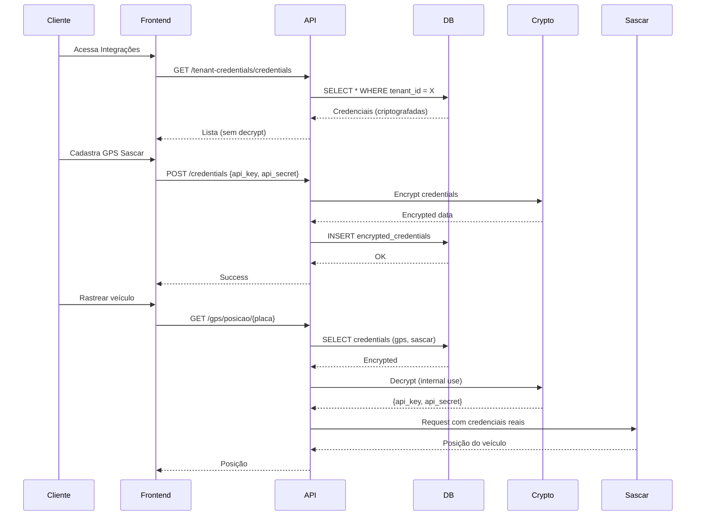

# 🔐 LogiFlow - Tenant Credentials

Sistema de gerenciamento de credenciais de integrações por tenant.

---

## 📋 Visão Geral

Cada tenant (transportadora) pode configurar suas próprias credenciais para integrações com:
- **ERP**: Omie, Bling, Tiny
- **GPS**: Sascar, Autotrac, Onixsat
- **Frete**: Melhor Envio, Frenet

As credenciais são **criptografadas** antes de serem salvas e só podem ser descriptografadas por **administradores autorizados** (RBAC).

---

## 🔒 Segurança

### Criptografia

- **Algoritmo**: Fernet (symmetric encryption)
- **Chave**: Gerada a partir de `SECRET_KEY` do backend
- **Storage**: Credenciais armazenadas em formato criptografado no banco

```python
from cryptography.fernet import Fernet

# Criptografar
encrypted = TenantCredentials.encrypt_credentials({"api_key": "abc123"})

# Descriptografar (apenas admin)
decrypted = TenantCredentials.decrypt_credentials(encrypted)
```

### RBAC

Endpoint de decrypt é protegido:

```python
@router.get("/credentials/{type}/{provider}/decrypt")
@require_permission("credentials:decrypt")  # Apenas admin
async def decrypt(...):
    # Todas as chamadas são auditadas
    audit_log(request, action="credentials:decrypt", ...)
```

---

## 📦 Tipos de Integração

### 1. ERP

#### Omie
```json
{
  "app_key": "1234567890",
  "app_secret": "abcdefghijklmnop",
  "environment": "production"
}
```

#### Bling
```json
{
  "api_key": "abc123xyz",
  "environment": "production"
}
```

#### Tiny
```json
{
  "api_token": "token_aqui",
  "environment": "production"
}
```

### 2. GPS

#### Sascar
```json
{
  "api_key": "sascar_key",
  "api_secret": "sascar_secret",
  "environment": "production"
}
```

#### Autotrac
```json
{
  "username": "usuario_autotrac",
  "password": "senha_autotrac",
  "environment": "production"
}
```

#### Onixsat
```json
{
  "api_token": "onixsat_token",
  "environment": "production"
}
```

### 3. Frete

#### Melhor Envio
```json
{
  "api_token": "token_melhor_envio",
  "sandbox": false
}
```

#### Frenet
```json
{
  "api_token": "token_frenet",
  "environment": "production"
}
```

---

## 🔧 API - Endpoints

### Listar Credenciais

```http
GET /api/v1/tenant-credentials/credentials
Authorization: Bearer {token}
X-Tenant-ID: 123
```

**Resposta**:
```json
{
  "success": true,
  "tenant_id": 123,
  "credentials": [
    {
      "id": 1,
      "integration_type": "gps",
      "provider": "sascar",
      "is_active": true,
      "is_validated": true,
      "last_validation": "2024-12-15T10:00:00Z",
      "created_at": "2024-12-01T08:00:00Z"
    }
  ]
}
```

### Criar Credencial

```http
POST /api/v1/tenant-credentials/credentials
Authorization: Bearer {token}
Content-Type: application/json

{
  "integration_type": "gps",
  "provider": "sascar",
  "credentials": {
    "api_key": "sua_chave_aqui",
    "api_secret": "seu_secret_aqui",
    "environment": "production"
  }
}
```

### Atualizar Credencial

```http
PUT /api/v1/tenant-credentials/credentials/{id}
Authorization: Bearer {token}
Content-Type: application/json

{
  "credentials": {
    "api_key": "nova_chave",
    "api_secret": "novo_secret",
    "environment": "production"
  },
  "is_active": true
}
```

### Deletar Credencial

```http
DELETE /api/v1/tenant-credentials/credentials/{id}
Authorization: Bearer {token}
```

### Validar Credencial

```http
POST /api/v1/tenant-credentials/credentials/{id}/validate
Authorization: Bearer {token}
```

Testa a conexão com o provider e atualiza `is_validated`.

### Descriptografar Credencial (Admin Only)

```http
GET /api/v1/tenant-credentials/credentials/gps/sascar/decrypt
Authorization: Bearer {admin_token}
X-Tenant-ID: 123
```

⚠️ **REQUER PERMISSÃO**: `credentials:decrypt` (apenas admin)
⚠️ **AUDITADO**: Todas as chamadas são registradas

**Resposta**:
```json
{
  "success": true,
  "credentials": {
    "api_key": "sascar_key_real",
    "api_secret": "sascar_secret_real",
    "environment": "production"
  },
  "warning": "⚠️ Esta operação foi auditada"
}
```

---

## 💻 Uso no Backend

### Obter Credenciais (Interno)

```python
from routers.tenant_credentials import _get_credentials

# Dentro de um router/endpoint
credentials = _get_credentials(db, tenant_id, "gps", "sascar")

if credentials:
    # Credenciais já descriptografadas
    sascar_client = SascarClient(
        api_key=credentials["api_key"],
        api_secret=credentials["api_secret"],
        simulation_mode=False  # Modo real
    )
else:
    # Sem credenciais, usar simulação
    sascar_client = SascarClient(simulation_mode=True)
```

### Exemplo: GPS Tracking

```python
@router.get("/gps/posicao/{placa}")
async def obter_posicao(
    placa: str,
    x_tenant_id: Optional[str] = Header(None),
    db: Session = Depends(get_db)
):
    tenant_id = int(x_tenant_id)
    
    # Buscar credenciais do tenant
    credentials = _get_credentials(db, tenant_id, "gps", "sascar")
    
    if not credentials:
        raise HTTPException(
            status_code=400,
            detail="Configure credenciais do Sascar em Configurações > Integrações"
        )
    
    # Usar credenciais reais
    client = SascarClient(**credentials, simulation_mode=False)
    posicao = client.obter_posicao_veiculo(placa)
    
    return posicao
```

---

## 🖥️ Uso no Frontend

### Listar Credenciais

```javascript
// IntegracoesView.vue
import api from '@/services/api'

async function carregarCredenciais() {
  const response = await api.get('/tenant-credentials/credentials')
  credenciais.value = response.data.credentials
}
```

### Cadastrar Nova Credencial

```javascript
async function salvarCredencial() {
  await api.post('/tenant-credentials/credentials', {
    integration_type: 'gps',
    provider: 'sascar',
    credentials: {
      api_key: form.api_key,
      api_secret: form.api_secret,
      environment: 'production'
    }
  })
  
  alert('Credencial salva com sucesso!')
}
```

### Validar Credencial

```javascript
async function validarCredencial(credentialId) {
  try {
    await api.post(`/tenant-credentials/credentials/${credentialId}/validate`)
    alert('✓ Credencial válida!')
  } catch (error) {
    alert('✗ Erro na validação: ' + error.response.data.detail)
  }
}
```

---

## 📊 Banco de Dados

### Tabela `tenant_credentials`

```sql
CREATE TABLE tenant_credentials (
    id INT PRIMARY KEY AUTO_INCREMENT,
    tenant_id INT NOT NULL,
    integration_type VARCHAR(50) NOT NULL,  -- 'erp', 'gps', 'freight'
    provider VARCHAR(50) NOT NULL,          -- 'sascar', 'omie', etc
    encrypted_credentials TEXT NOT NULL,    -- JSON criptografado
    is_active BOOLEAN DEFAULT TRUE,
    is_validated BOOLEAN DEFAULT FALSE,
    last_validation DATETIME,
    created_at DATETIME DEFAULT CURRENT_TIMESTAMP,
    updated_at DATETIME ON UPDATE CURRENT_TIMESTAMP,
    created_by INT,
    
    FOREIGN KEY (tenant_id) REFERENCES tenants(id) ON DELETE CASCADE,
    UNIQUE KEY unique_tenant_integration (tenant_id, integration_type, provider),
    INDEX idx_tenant_id (tenant_id),
    INDEX idx_integration_type (integration_type),
    INDEX idx_provider (provider)
);
```

---

## 🔄 Fluxo de Uso



---

## 🧪 Validação de Credenciais

Cada provider tem sua própria validação:

### Sascar
```python
def validate_sascar_credentials(api_key, api_secret):
    client = SascarClient(api_key=api_key, api_secret=api_secret)
    try:
        # Tentar listar veículos
        response = client.listar_veiculos()
        return response.get("success", False)
    except:
        return False
```

### Omie
```python
def validate_omie_credentials(app_key, app_secret):
    client = OmieClient(app_key=app_key, app_secret=app_secret)
    try:
        # Tentar listar clientes
        response = client.listar_clientes(pagina=1, registros_por_pagina=1)
        return "clientes_cadastro" in response
    except:
        return False
```

---

## 🚨 Segurança - Best Practices

### ✅ DO

1. **Sempre criptografar** antes de salvar no banco
2. **Validar schemas** antes de aceitar credenciais
3. **Auditar decrypt** de credenciais
4. **Usar HTTPS** em produção
5. **Rotacionar chaves** periodicamente
6. **Testar credenciais** após cadastro

### ❌ DON'T

1. **Nunca logar** credenciais descriptografadas
2. **Nunca expor** endpoint de decrypt publicamente
3. **Nunca retornar** credenciais em texto claro
4. **Nunca compartilhar** credenciais entre tenants
5. **Nunca commitar** credenciais no código
6. **Nunca usar** credenciais de teste em produção

---

## 📝 Schemas de Validação

```python
# models/tenant_credentials.py

ERP_CREDENTIALS_SCHEMAS = {
    "omie": ["app_key", "app_secret", "environment"],
    "bling": ["api_key", "environment"],
    "tiny": ["api_token", "environment"]
}

GPS_CREDENTIALS_SCHEMAS = {
    "sascar": ["api_key", "api_secret", "environment"],
    "autotrac": ["username", "password", "environment"],
    "onixsat": ["api_token", "environment"]
}

FREIGHT_CREDENTIALS_SCHEMAS = {
    "melhor_envio": ["api_token", "sandbox"],
    "frenet": ["api_token", "environment"]
}
```

---

## 🛠️ Troubleshooting

### Credencial inválida após cadastro

**Causa**: Credenciais incorretas ou ambiente errado

**Solução**:
1. Verificar se as credenciais estão corretas
2. Testar endpoint de validação
3. Verificar ambiente (production vs sandbox)

### Erro ao descriptografar

**Causa**: `SECRET_KEY` mudou ou credencial corrompida

**Solução**:
```python
# Verificar SECRET_KEY
print(settings.SECRET_KEY)

# Recriar credencial
DELETE /credentials/{id}
POST /credentials {...}
```

### GPS não funciona após configurar

**Causa**: Provider ainda está em simulation_mode

**Solução**:
```python
# Verificar no código
client = SascarClient(
    **credentials,
    simulation_mode=False  # Deve ser False!
)
```

---

## ✅ Checklist

- [x] Tabela `tenant_credentials`
- [x] Modelo SQLAlchemy
- [x] Criptografia Fernet
- [x] Schemas de validação
- [x] Router de credenciais
- [x] CRUD completo
- [x] Proteção RBAC em decrypt
- [x] Auditoria de decrypt
- [x] Helpers `_get_credentials`
- [x] Integração com GPS
- [x] Integração com Frete
- [ ] Integração com ERP (pending)
- [ ] Frontend completo (pending)
- [ ] Testes unitários (pending)

---

**Última atualização**: 2024-12-15  
**Versão**: 2.0.0

