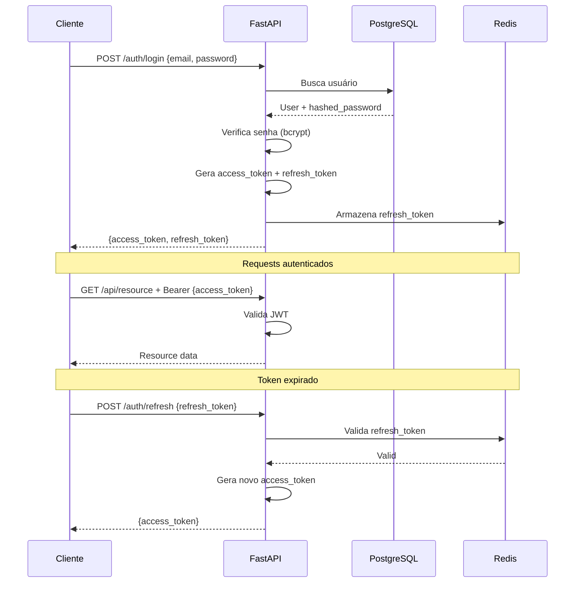

# ADR-004: Estratégia de Autenticação com JWT

## Status
**Aceita**

## Data
Janeiro 2026

## Contexto

O LogiFlow CRM precisa de um sistema de autenticação que:

- Funcione para múltiplas aplicações (SPA, PWA, API)
- Suporte multi-tenancy (identificação do tenant)
- Seja stateless para escalabilidade
- Permita refresh de tokens sem re-login
- Suporte diferentes níveis de permissão (RBAC)

### Aplicações que consomem a API
1. CRM Frontend (Vue.js SPA)
2. App Motorista (Vue.js PWA)
3. Portal Cliente (Vue.js SPA)
4. Integrações de terceiros (API keys)

## Decisão

Implementamos autenticação baseada em **JWT (JSON Web Tokens)** com:

- **Access Token**: Curta duração (15 min)
- **Refresh Token**: Longa duração (7 dias)
- **Payload com tenant_id**: Para isolamento multi-tenant

```python
# Estrutura do JWT
{
    "sub": "user_uuid",
    "email": "user@example.com",
    "tenant_id": "tenant_uuid",
    "tipo": "admin|operador|motorista",
    "exp": 1234567890,
    "iat": 1234567890
}
```

## Consequências

### Positivas

- **Stateless**: Não requer sessão no servidor
- **Escalável**: Qualquer instância pode validar o token
- **Multi-tenant**: tenant_id no payload
- **Performance**: Validação local (sem DB hit)
- **Flexível**: Funciona com SPA, PWA, mobile, API
- **Padronizado**: RFC 7519, amplamente suportado

### Negativas

- **Revogação difícil**: Tokens válidos até expirar
- **Tamanho**: Maior que session IDs tradicionais
- **Segurança do secret**: Comprometimento = tokens forjados
- **Refresh complexity**: Lógica de refresh adicional

### Riscos Mitigados

| Risco | Mitigação |
|-------|-----------|
| Token roubado | Curta expiração (15 min) + HTTPS only |
| Refresh token roubado | Armazenado em Redis + rotação |
| Secret comprometido | Rotação de secrets + múltiplos secrets |
| XSS | httpOnly cookies para refresh token |

## Implementação

### Geração de Tokens

```python
from jose import jwt
from datetime import datetime, timedelta

SECRET_KEY = settings.SECRET_KEY
ALGORITHM = "HS256"
ACCESS_TOKEN_EXPIRE_MINUTES = 15
REFRESH_TOKEN_EXPIRE_DAYS = 7

def create_access_token(data: dict) -> str:
    to_encode = data.copy()
    expire = datetime.utcnow() + timedelta(minutes=ACCESS_TOKEN_EXPIRE_MINUTES)
    to_encode.update({"exp": expire, "type": "access"})
    return jwt.encode(to_encode, SECRET_KEY, algorithm=ALGORITHM)

def create_refresh_token(data: dict) -> str:
    to_encode = data.copy()
    expire = datetime.utcnow() + timedelta(days=REFRESH_TOKEN_EXPIRE_DAYS)
    to_encode.update({"exp": expire, "type": "refresh"})
    return jwt.encode(to_encode, SECRET_KEY, algorithm=ALGORITHM)
```

### Validação de Tokens

```python
from fastapi import Depends, HTTPException
from fastapi.security import HTTPBearer

security = HTTPBearer()

async def get_current_user(
    credentials: HTTPAuthorizationCredentials = Depends(security)
) -> User:
    token = credentials.credentials
    try:
        payload = jwt.decode(token, SECRET_KEY, algorithms=[ALGORITHM])
        user_id = payload.get("sub")
        if user_id is None:
            raise HTTPException(status_code=401, detail="Token inválido")
    except JWTError:
        raise HTTPException(status_code=401, detail="Token inválido")
    
    # Busca usuário (com cache)
    user = await get_user_by_id(user_id)
    if user is None:
        raise HTTPException(status_code=401, detail="Usuário não encontrado")
    
    return user
```

### Fluxo de Autenticação



## Alternativas Consideradas

### Session-based Authentication
- ✅ Revogação instantânea
- ✅ Menor tamanho de cookie
- ❌ Stateful (requer sessão no servidor)
- ❌ Difícil escalar horizontalmente
- ❌ Problemas com CORS em SPAs

**Descartado por**: Não escala bem e complica SPAs.

### OAuth2 + OpenID Connect (terceiros)
- ✅ Login social (Google, GitHub)
- ✅ SSO corporativo
- ❌ Complexidade de implementação
- ❌ Dependência de terceiros
- ❌ Overhead para casos simples

**Descartado por**: Over-engineering para o caso atual. Pode ser adicionado posteriormente.

### API Keys
- ✅ Simples para integrações
- ❌ Sem contexto de usuário
- ❌ Difícil rotação
- ❌ Não adequado para browsers

**Parcialmente adotado**: Usado para webhooks e integrações M2M.

## Configuração de Segurança

```python
# settings.py
SECRET_KEY = os.getenv("SECRET_KEY")  # 256-bit random
ALGORITHM = "HS256"
ACCESS_TOKEN_EXPIRE_MINUTES = 15
REFRESH_TOKEN_EXPIRE_DAYS = 7

# Password hashing
from passlib.context import CryptContext
pwd_context = CryptContext(schemes=["bcrypt"], deprecated="auto")
```

## Validação

1. **Testes de segurança**: Tokens não podem ser forjados
2. **Teste de expiração**: Tokens expiram corretamente
3. **Teste de refresh**: Refresh funciona sem re-login
4. **Teste de revogação**: Logout invalida refresh token

## Referências

- [RFC 7519 - JSON Web Token](https://tools.ietf.org/html/rfc7519)
- [python-jose Documentation](https://python-jose.readthedocs.io/)
- [OWASP JWT Cheat Sheet](https://cheatsheetseries.owasp.org/cheatsheets/JSON_Web_Token_for_Java_Cheat_Sheet.html)
