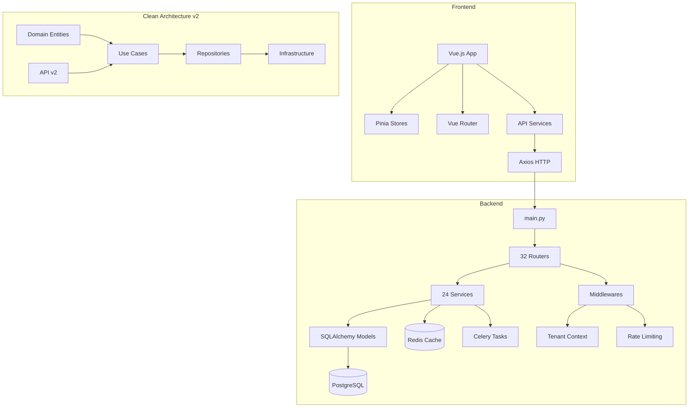
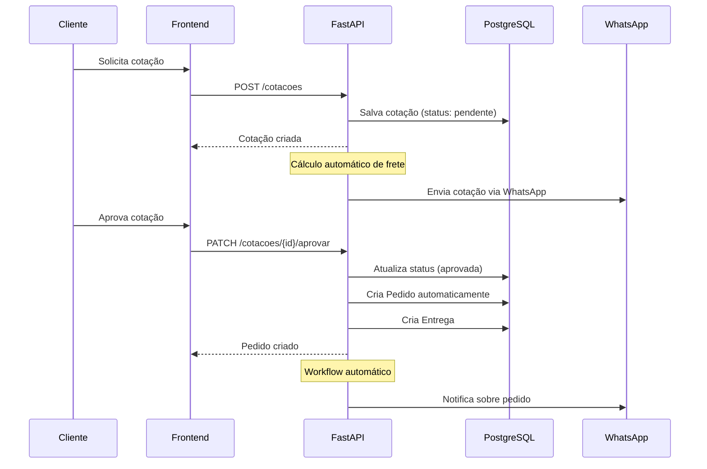
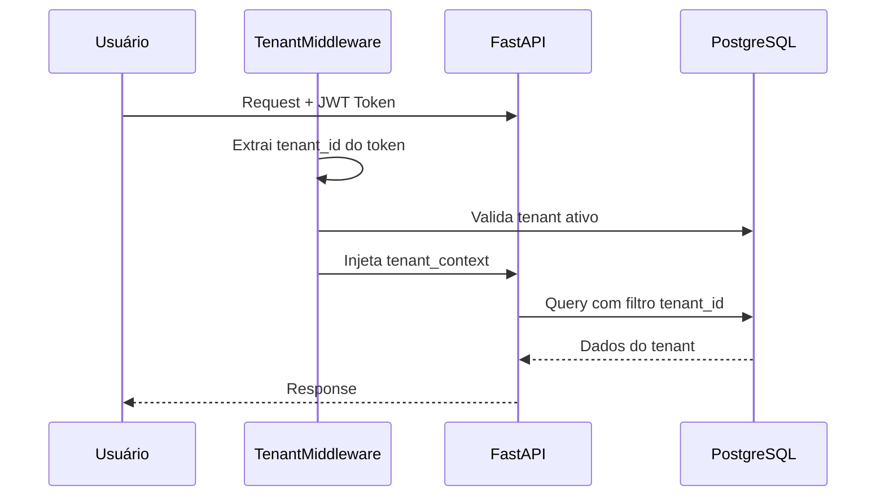
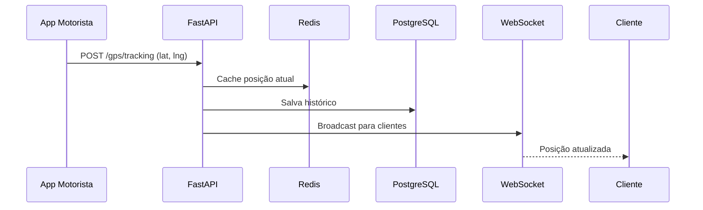
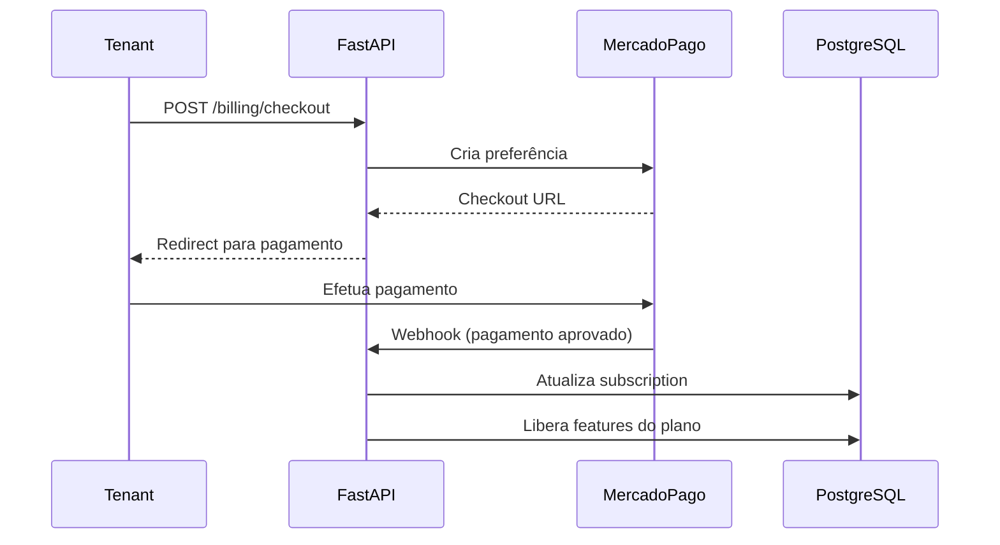

# LogiFlow CRM - Análise do Estado Atual

> **Data da Análise:** Janeiro 2026  
> **Versão do Projeto:** 1.0.0  
> **Autor:** Leonardo Fragoso

---

## 📋 Sumário Executivo

O **LogiFlow CRM** é um sistema de CRM especializado para transportadoras, desenvolvido com arquitetura moderna utilizando **FastAPI (Python)** no backend e **Vue.js 3** no frontend. O projeto já apresenta elementos de Clean Architecture parcialmente implementados e possui infraestrutura Docker e CI/CD configurados.

---

## 🏗️ 1. Componentes e Módulos Principais

### 1.1 Backend (FastAPI)

| Componente | Localização | Descrição |
|------------|-------------|-----------|
| **API Principal** | `/backend/main.py` | Aplicação FastAPI com lifecycle management |
| **Routers** | `/backend/routers/` | 32 módulos de endpoints |
| **Services** | `/backend/services/` | 24 serviços de negócio |
| **Models** | `/backend/models.py` | SQLAlchemy ORM (911 linhas) |
| **Domain** | `/backend/domain/` | Entidades, Value Objects, Interfaces |
| **Application** | `/backend/application/` | DTOs e Use Cases |
| **Infrastructure** | `/backend/infrastructure/` | Repositories, DI Container |
| **Presentation** | `/backend/presentation/` | API v2 (Clean Architecture) |
| **Middleware** | `/backend/middleware/` | CORS, Rate Limit, Tenant, Correlation |

#### Módulos de Routers (32 arquivos):
```
auth, billing, clientes, cotacao_automatica, cotacoes, crm_enterprise,
dashboard, demo, entregas, erp, features, fiscal, gps_self_service,
gps_tracking, health_score, integrations, integrations_self_service,
leads, maps, melhor_envio, motoristas, nps, ocorrencias, pedidos,
plan_info, rastreamento, tenant_credentials, tenants, veiculos, whatsapp
```

#### Serviços de Negócio (24 arquivos):
```
cache_service, chatbot_service, crm_alerts_service, crm_metrics_service,
crm_sync_service, database_provisioning, email_service, encryption_service,
erp_sync, fiscal_service, health_score, health_score_service,
integration_manager, maps_service, mercadopago_service, notification_service,
nps_service, opportunity_sla_service, sales_forecast_service, scheduler,
tenant_provisioning, whatsapp_crm_sync, whatsapp_service
```

### 1.2 Frontend (Vue.js 3)

| Componente | Localização | Descrição |
|------------|-------------|-----------|
| **Views** | `/frontend/src/views/` | 49 páginas/componentes de view |
| **Components** | `/frontend/src/components/` | 9 componentes reutilizáveis |
| **Stores** | `/frontend/src/stores/` | 3 stores Pinia |
| **Services** | `/frontend/src/services/` | 2 serviços de API |
| **Composables** | `/frontend/src/composables/` | 2 composables |
| **Router** | `/frontend/src/router/` | Configuração Vue Router |

### 1.3 Aplicações Adicionais

| Aplicação | Localização | Tecnologia |
|-----------|-------------|------------|
| **App Motorista** | `/app-motorista/` | Vue.js (PWA) |
| **Portal Cliente** | `/portal-cliente/` | Vue.js |
| **Site Divulgação** | `/site-divulgacao/` | Vue.js |

---

## 🔗 2. Mapeamento de Dependências

### 2.1 Dependências do Backend

```
┌─────────────────────────────────────────────────────────────────────┐
│                        BACKEND DEPENDENCIES                          │
├─────────────────────────────────────────────────────────────────────┤
│ Framework:     FastAPI 0.104+, Uvicorn 0.24+, Pydantic 2.5+         │
│ Database:      SQLAlchemy 2.0+, Alembic 1.12+, psycopg2-binary      │
│ Cache:         Redis 5.0+                                            │
│ Auth:          python-jose, PyJWT 2.8+, passlib[bcrypt]             │
│ HTTP:          httpx 0.25+, requests 2.31+                          │
│ Tasks:         Celery 5.3+, APScheduler 3.10+                       │
│ Logging:       Loguru 0.7+                                           │
│ Payments:      mercadopago 2.2+                                      │
│ Crypto:        cryptography 41.0+                                    │
└─────────────────────────────────────────────────────────────────────┘
```

### 2.2 Dependências do Frontend

```
┌─────────────────────────────────────────────────────────────────────┐
│                       FRONTEND DEPENDENCIES                          │
├─────────────────────────────────────────────────────────────────────┤
│ Framework:     Vue 3.4+, Vue Router 4.2+, Pinia 2.1+                │
│ Build:         Vite 5.0+                                             │
│ Styling:       TailwindCSS 3.4+, @tailwindcss/forms                 │
│ HTTP:          Axios 1.6+                                            │
│ Utils:         @vueuse/core 10.7+, dayjs 1.11+                      │
│ Lint:          ESLint 8.56+, eslint-plugin-vue 9.19+                │
└─────────────────────────────────────────────────────────────────────┘
```

### 2.3 Grafo de Dependências entre Módulos



---

## ⚠️ 3. Code Smells e Anti-Patterns Identificados

### 3.1 Problemas Críticos

| ID | Problema | Localização | Severidade |
|----|----------|-------------|------------|
| CS-01 | **Arquivo monolítico de models** | `models.py` (911 linhas) | Alta |
| CS-02 | **Duplicação de lógica** | Routers vs Services | Média |
| CS-03 | **Try/except genéricos** | `main.py` imports | Média |
| CS-04 | **Arquitetura híbrida incompleta** | v1 vs v2 routers | Alta |
| CS-05 | **Documentação desatualizada** | `docs/ARCHITECTURE.md` menciona SuiteCRM | Baixa |

### 3.2 Detalhamento

#### CS-01: Arquivo Monolítico de Models
```python
# models.py tem 911 linhas com ~30 modelos diferentes
# Solução: Separar em arquivos por domínio
# /models/auth.py, /models/crm.py, /models/fiscal.py, etc.
```

#### CS-02: Duplicação de Lógica
```python
# Lógica de negócio presente tanto em routers quanto em services
# Routers deveriam apenas orquestrar, não implementar lógica
```

#### CS-03: Try/Except Genéricos
```python
# main.py:32-98 - Imports com try/except que mascaram erros
try:
    from routers import fiscal, rastreamento, ...
except ImportError as e:
    logger.warning(f"Erro ao importar routers: {e}")
    fiscal = None  # Pode mascarar problemas reais
```

#### CS-04: Arquitetura Híbrida Incompleta
```python
# Routers v1 (32 arquivos) coexistem com v2 (3 arquivos)
# Clean Architecture implementada apenas para: clientes, cotacoes, pedidos
# Restante ainda usa padrão legado
```

### 3.3 Oportunidades de Melhoria

1. **Separar models.py** em módulos por domínio
2. **Migrar routers v1** para padrão Clean Architecture
3. **Implementar tratamento de erros** mais específico
4. **Remover código comentado** e imports não utilizados
5. **Padronizar nomenclatura** (português/inglês misturados)

---

## 📦 4. Tecnologias e Versões

### 4.1 Stack Principal

| Camada | Tecnologia | Versão | Status |
|--------|------------|--------|--------|
| **Backend Framework** | FastAPI | ≥0.104.0 | ✅ Atualizado |
| **ASGI Server** | Uvicorn | ≥0.24.0 | ✅ Atualizado |
| **ORM** | SQLAlchemy | ≥2.0.0 | ✅ Atualizado |
| **Database** | PostgreSQL | 15-alpine | ✅ Atualizado |
| **Cache** | Redis | 7-alpine | ✅ Atualizado |
| **Task Queue** | Celery | ≥5.3.0 | ✅ Atualizado |
| **Frontend Framework** | Vue.js | ≥3.4.0 | ✅ Atualizado |
| **Build Tool** | Vite | ≥5.0.10 | ✅ Atualizado |
| **CSS Framework** | TailwindCSS | ≥3.4.0 | ✅ Atualizado |
| **State Management** | Pinia | ≥2.1.7 | ✅ Atualizado |

### 4.2 Ferramentas de Desenvolvimento

| Ferramenta | Versão | Uso |
|------------|--------|-----|
| Python | 3.11 | Runtime backend |
| Node.js | 20 | Runtime frontend |
| Docker | Latest | Containerização |
| Docker Compose | v2 | Orquestração local |
| GitHub Actions | v4 | CI/CD |
| Alembic | ≥1.12.0 | Migrations |
| pytest | ≥7.4.0 | Testes Python |
| ESLint | ≥8.56.0 | Linting JS/Vue |
| Ruff | Latest | Linting Python |

---

## 🔄 5. Fluxos Críticos de Negócio

### 5.1 Fluxo de Cotação → Pedido → Entrega



### 5.2 Fluxo de Multi-Tenancy



### 5.3 Fluxo de Rastreamento GPS



### 5.4 Fluxo de Billing/Assinatura



---

## 📊 6. Métricas do Código

### 6.1 Contagem de Arquivos

| Tipo | Quantidade |
|------|------------|
| Arquivos Python (.py) | ~100+ |
| Arquivos Vue (.vue) | ~60+ |
| Arquivos JavaScript (.js) | ~15+ |
| Arquivos Markdown (.md) | ~80+ |
| Docker/YAML | ~15+ |
| Testes | ~15+ |

### 6.2 Linhas de Código (Estimativa)

| Componente | LOC Estimado |
|------------|--------------|
| Backend Python | ~25,000 |
| Frontend Vue/JS | ~8,000 |
| Documentação | ~15,000 |
| Configuração | ~2,000 |
| **Total** | **~50,000** |

### 6.3 Cobertura de Testes Atual

| Tipo de Teste | Arquivos | Status |
|---------------|----------|--------|
| Unit Tests | 5 | ✅ Implementados |
| Integration Tests | 8 | ⚠️ Parciais |
| E2E/Smoke Tests | 1 | ✅ Implementado |
| **Cobertura Total** | - | **~30-40%** |

---

## 🏛️ 7. Arquitetura Atual

### 7.1 Visão Geral

```
┌──────────────────────────────────────────────────────────────────────┐
│                           CLIENTS                                     │
│    ┌──────────┐  ┌──────────┐  ┌──────────┐  ┌──────────┐           │
│    │ Frontend │  │   App    │  │  Portal  │  │   Site   │           │
│    │  (CRM)   │  │Motorista │  │ Cliente  │  │Divulgação│           │
│    └────┬─────┘  └────┬─────┘  └────┬─────┘  └────┬─────┘           │
└─────────┼─────────────┼─────────────┼─────────────┼─────────────────┘
          │             │             │             │
          └─────────────┴──────┬──────┴─────────────┘
                               │ HTTP/REST
                               ▼
┌──────────────────────────────────────────────────────────────────────┐
│                        BACKEND (FastAPI)                              │
│  ┌─────────────────────────────────────────────────────────────────┐ │
│  │                      MIDDLEWARE LAYER                            │ │
│  │   ┌────────┐ ┌────────┐ ┌────────┐ ┌────────────┐               │ │
│  │   │  CORS  │ │ Tenant │ │  Rate  │ │Correlation │               │ │
│  │   │        │ │Context │ │ Limit  │ │    ID      │               │ │
│  │   └────────┘ └────────┘ └────────┘ └────────────┘               │ │
│  └─────────────────────────────────────────────────────────────────┘ │
│  ┌─────────────────────────────────────────────────────────────────┐ │
│  │                       ROUTER LAYER (v1)                          │ │
│  │   32 routers: auth, billing, clientes, cotacoes, pedidos...     │ │
│  └─────────────────────────────────────────────────────────────────┘ │
│  ┌─────────────────────────────────────────────────────────────────┐ │
│  │                      SERVICE LAYER                               │ │
│  │   24 services: email, whatsapp, billing, gps, nps...            │ │
│  └─────────────────────────────────────────────────────────────────┘ │
│  ┌─────────────────────────────────────────────────────────────────┐ │
│  │                   CLEAN ARCHITECTURE (v2)                        │ │
│  │   ┌─────────┐ ┌─────────┐ ┌─────────┐ ┌──────────────┐          │ │
│  │   │ Domain  │ │  App    │ │  Infra  │ │ Presentation │          │ │
│  │   │Entities │ │UseCases │ │  Repos  │ │    API v2    │          │ │
│  │   └─────────┘ └─────────┘ └─────────┘ └──────────────┘          │ │
│  └─────────────────────────────────────────────────────────────────┘ │
└──────────────────────────────────────────────────────────────────────┘
                               │
          ┌────────────────────┼────────────────────┐
          │                    │                    │
          ▼                    ▼                    ▼
┌──────────────────┐ ┌──────────────────┐ ┌──────────────────┐
│    PostgreSQL    │ │      Redis       │ │     Celery       │
│    (Database)    │ │     (Cache)      │ │     (Tasks)      │
└──────────────────┘ └──────────────────┘ └──────────────────┘
```

### 7.2 Clean Architecture (Parcialmente Implementada)

```
backend/
├── domain/                    # Camada de Domínio
│   ├── entities/              # Entidades de negócio
│   │   ├── cliente.py
│   │   ├── cotacao.py
│   │   └── pedido.py
│   ├── value_objects/         # Value Objects
│   ├── interfaces/            # Contratos (Interfaces)
│   └── exceptions/            # Exceções de domínio
│
├── application/               # Camada de Aplicação
│   ├── use_cases/             # Casos de uso
│   │   ├── cliente_use_cases.py
│   │   └── cotacao_use_cases.py
│   └── dtos/                  # Data Transfer Objects
│
├── infrastructure/            # Camada de Infraestrutura
│   ├── repositories/          # Implementações de repositórios
│   ├── persistence/           # Configuração de banco
│   └── container.py           # Dependency Injection
│
└── presentation/              # Camada de Apresentação
    └── api/                   # API v2 endpoints
```

---

## 🔒 8. Segurança Atual

### 8.1 Implementações Existentes

| Recurso | Status | Detalhes |
|---------|--------|----------|
| **JWT Authentication** | ✅ | python-jose + PyJWT |
| **Password Hashing** | ✅ | passlib[bcrypt] |
| **CORS** | ✅ | Configurado em main.py |
| **Rate Limiting** | ✅ | Middleware customizado |
| **Multi-Tenancy Isolation** | ✅ | TenantMiddleware |
| **Environment Variables** | ✅ | .env files (não commitados) |
| **HTTPS** | ⚠️ | Depende do deploy |
| **Input Validation** | ✅ | Pydantic v2 |
| **SQL Injection Prevention** | ✅ | SQLAlchemy ORM |

### 8.2 Pontos de Atenção

- ⚠️ Secrets hardcoded em docker-compose (dev only)
- ⚠️ DEBUG=True em configurações de desenvolvimento
- ⚠️ Falta CSRF para formulários web tradicionais

---

## 🚀 9. DevOps e Infraestrutura

### 9.1 Docker

| Arquivo | Serviços |
|---------|----------|
| `docker-compose.yml` | db, redis, api, frontend, site, celery_worker, celery_beat, adminer |
| `docker-compose.production.yml` | Configuração otimizada para produção |
| `docker-compose.minimal.yml` | Setup mínimo para desenvolvimento |

### 9.2 CI/CD (GitHub Actions)

| Workflow | Arquivo | Triggers |
|----------|---------|----------|
| CI | `ci.yml` | push/PR para main, develop |
| CD | `cd.yml` | push para main, tags v* |

**CI Pipeline:**
1. ✅ Backend Tests (pytest)
2. ✅ Backend Lint (Ruff)
3. ✅ Frontend Tests/Build
4. ✅ Docker Build Test
5. ✅ Security Scan (Trivy)

**CD Pipeline:**
1. ✅ Build & Push Docker Image
2. ✅ Deploy Staging (Render)
3. ✅ Deploy Production (manual/tags)
4. ✅ Run Migrations

### 9.3 Deploy

- **Plataforma:** Render.com
- **Registry:** GitHub Container Registry (ghcr.io)
- **Database:** PostgreSQL (managed)
- **Cache:** Redis (managed)

---

## 📈 10. Recomendações de Melhorias

### 10.1 Prioridade Alta

1. **Completar migração para Clean Architecture** - Migrar os 32 routers v1 para o padrão v2
2. **Aumentar cobertura de testes** - De ~35% para 80%+
3. **Separar models.py** - Refatorar em módulos por domínio
4. **Documentar API completa** - Todos os endpoints no Swagger

### 10.2 Prioridade Média

5. **Implementar pre-commit hooks** - Automatizar lint/format
6. **Adicionar health metrics** - Prometheus + Grafana
7. **Padronizar nomenclatura** - Escolher português OU inglês
8. **Criar ADRs faltantes** - Documentar decisões arquiteturais

### 10.3 Prioridade Baixa

9. **Atualizar documentação desatualizada** - Remover referências a SuiteCRM
10. **Otimizar Dockerfile** - Multi-stage build completo
11. **Implementar feature flags** - Para rollout gradual
12. **Criar dashboards de monitoramento** - Observabilidade completa

---

## ✅ 11. Checklist de Conformidade

| Critério | Status | Ação |
|----------|--------|------|
| Clean Architecture | ⚠️ Parcial | Completar migração |
| Testes > 80% | ❌ ~35% | Implementar mais testes |
| Documentação API | ⚠️ Parcial | Completar Swagger |
| CI/CD | ✅ Completo | Manter |
| Docker | ✅ Completo | Otimizar |
| Security | ⚠️ Parcial | OWASP checklist |
| Logging | ✅ Loguru | Adicionar métricas |
| Error Handling | ⚠️ Parcial | Padronizar |

---

## 📚 Referências

- [FastAPI Documentation](https://fastapi.tiangolo.com/)
- [Vue.js 3 Documentation](https://vuejs.org/)
- [Clean Architecture - Uncle Bob](https://blog.cleancoder.com/uncle-bob/2012/08/13/the-clean-architecture.html)
- [C4 Model](https://c4model.com/)

---

*Documento gerado como parte do processo de refatoração para padrão de desenvolvedor pleno.*
