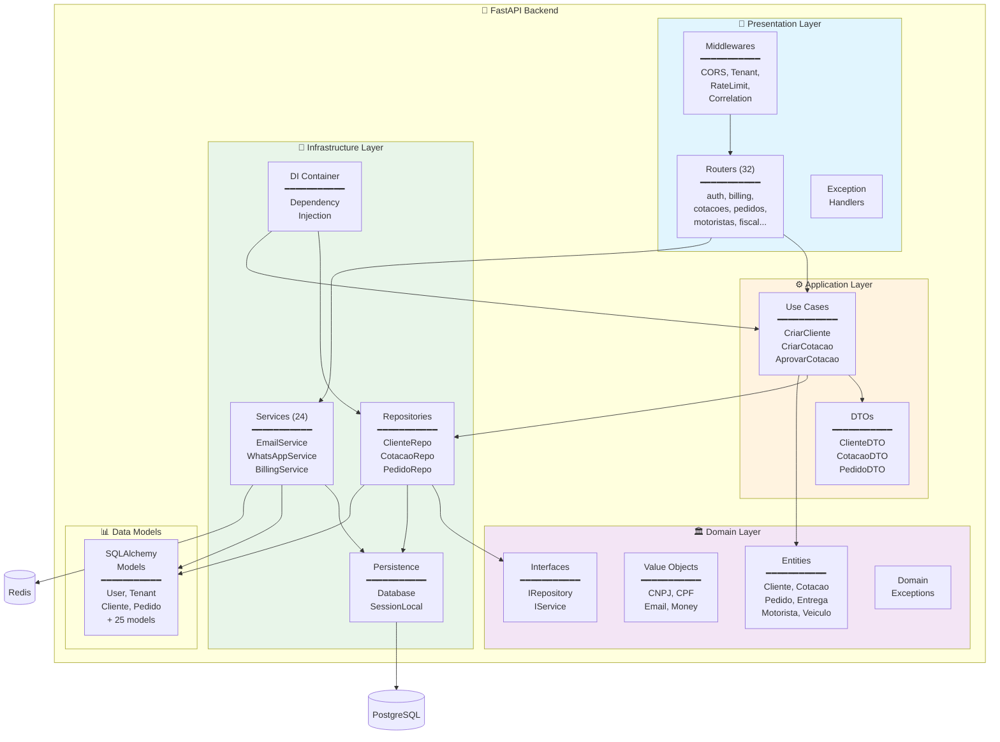
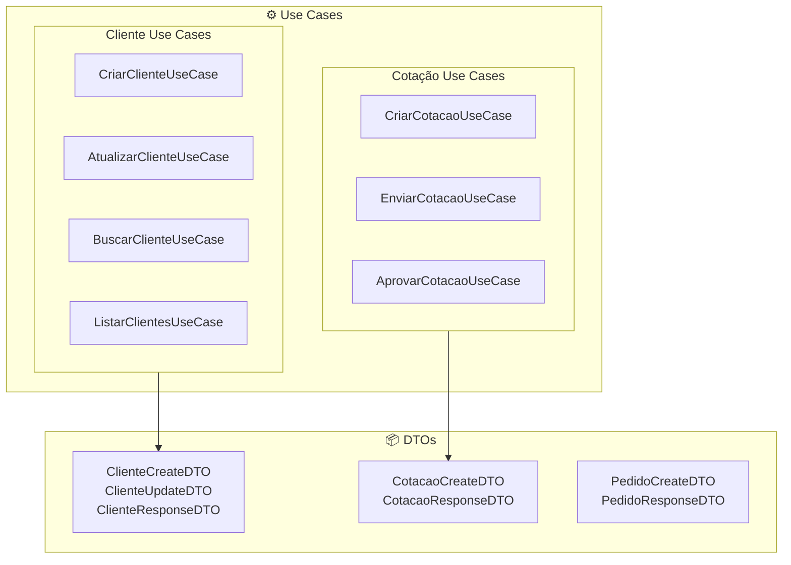
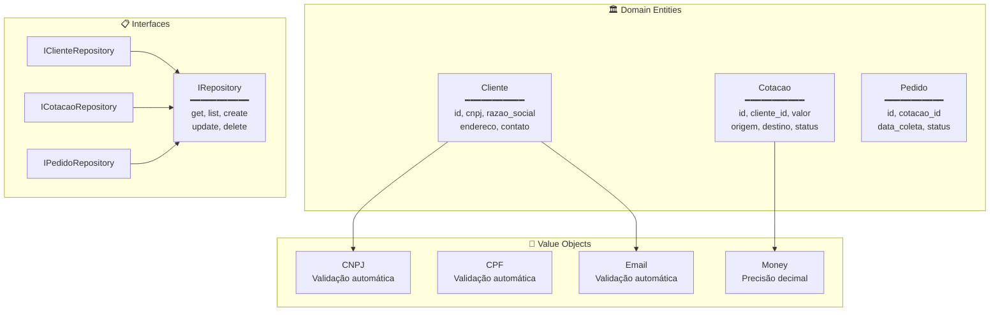
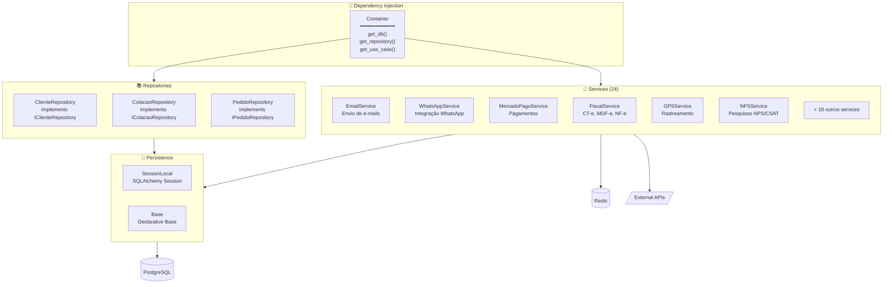
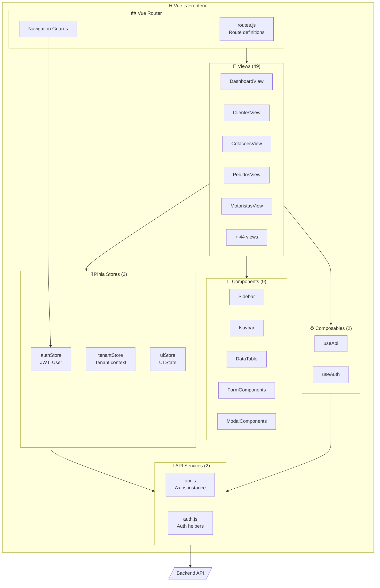
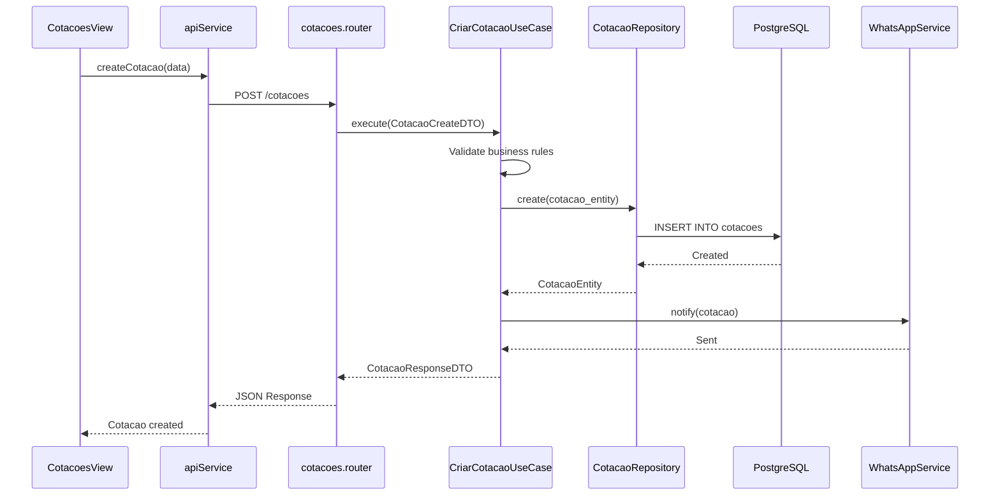
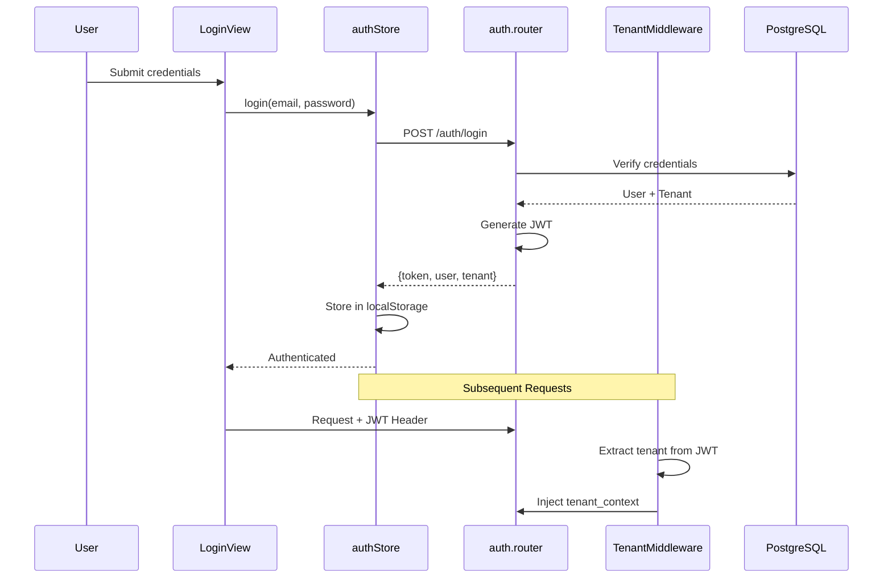
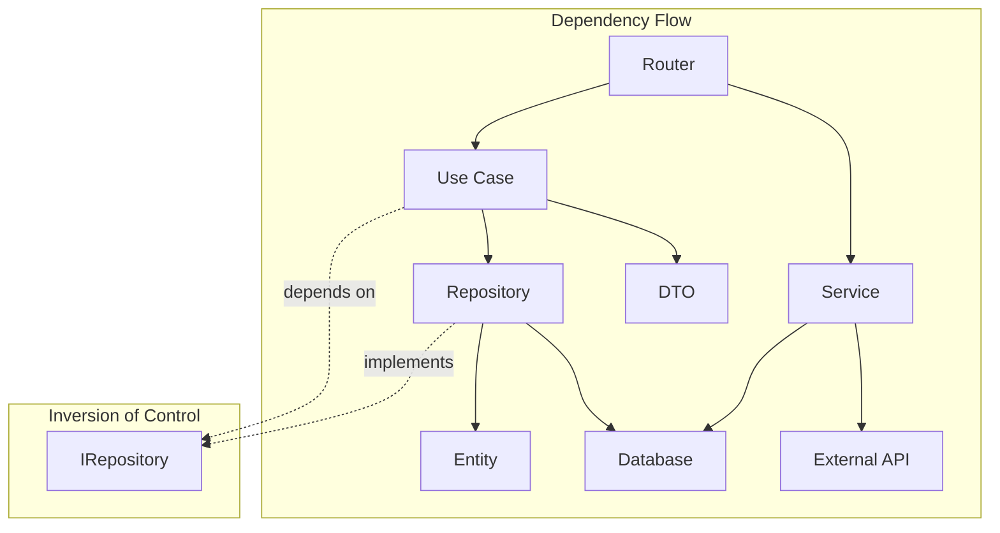

# LogiFlow CRM - C4 Model: Component Diagram (Nível 3)

> **Versão:** 1.0.0  
> **Atualizado:** Janeiro 2026

## Descrição

O Diagrama de Componentes mostra a estrutura interna dos principais containers, detalhando os componentes, suas responsabilidades e interações.

---

## 1. API Backend - Componentes

---

## 2. Detalhamento por Camada

### 2.1 Presentation Layer

```mermaid
flowchart LR
    subgraph Routers["📡 Routers (32 módulos)"]
        direction TB
        R_AUTH["auth.py<br/>Login, JWT"]
        R_BILLING["billing.py<br/>Planos, Pagamentos"]
        R_COTACOES["cotacoes.py<br/>CRUD Cotações"]
        R_PEDIDOS["pedidos.py<br/>CRUD Pedidos"]
        R_MOTORISTAS["motoristas.py<br/>CRUD Motoristas"]
        R_FISCAL["fiscal.py<br/>CT-e, MDF-e"]
        R_WHATSAPP["whatsapp.py<br/>Mensagens"]
        R_GPS["gps_tracking.py<br/>Rastreamento"]
        R_OUTROS["+ 24 outros<br/>routers"]
    end
    
    subgraph Middlewares["🔒 Middlewares"]
        direction TB
        M_CORS["CORSMiddleware"]
        M_TENANT["TenantMiddleware"]
        M_RATE["RateLimitMiddleware"]
        M_CORR["CorrelationMiddleware"]
    end
    
    REQ[/"Request"/] --> M_CORS --> M_TENANT --> M_RATE --> M_CORR --> Routers
```

#### Componentes de Routers

| Componente | Arquivo | Responsabilidade |
|------------|---------|------------------|
| **Auth Router** | `auth.py` | Login, registro, JWT, refresh tokens |
| **Billing Router** | `billing.py` | Checkout, webhooks, planos |
| **Cotações Router** | `cotacoes.py` | CRUD de cotações de frete |
| **Pedidos Router** | `pedidos.py` | CRUD de pedidos confirmados |
| **Motoristas Router** | `motoristas.py` | CRUD de motoristas |
| **Fiscal Router** | `fiscal.py` | Emissão de CT-e, MDF-e, NF-e |
| **WhatsApp Router** | `whatsapp.py` | Envio de mensagens e chatbot |
| **GPS Router** | `gps_tracking.py` | Rastreamento em tempo real |
| **CRM Enterprise** | `crm_enterprise.py` | Módulo CRM nativo |

---

### 2.2 Application Layer

#### Use Cases Implementados

| Use Case | Descrição | Entrada | Saída |
|----------|-----------|---------|-------|
| `CriarClienteUseCase` | Cria novo cliente | ClienteCreateDTO | ClienteResponseDTO |
| `AtualizarClienteUseCase` | Atualiza cliente | ClienteUpdateDTO | ClienteResponseDTO |
| `BuscarClienteUseCase` | Busca por ID | UUID | ClienteResponseDTO |
| `ListarClientesUseCase` | Lista paginada | PaginationDTO | List[ClienteResponseDTO] |
| `CriarCotacaoUseCase` | Cria cotação | CotacaoCreateDTO | CotacaoResponseDTO |
| `EnviarCotacaoUseCase` | Envia ao cliente | UUID | CotacaoResponseDTO |
| `AprovarCotacaoUseCase` | Aprova cotação | UUID | PedidoResponseDTO |

---

### 2.3 Domain Layer

#### Entidades de Domínio

| Entidade | Atributos Principais | Value Objects |
|----------|---------------------|---------------|
| **Cliente** | id, cnpj, razao_social, endereco, telefone, email | CNPJ, Email |
| **Cotacao** | id, cliente_id, origem, destino, peso, valor, status | Money |
| **Pedido** | id, cotacao_id, motorista_id, data_coleta, status | - |

---

### 2.4 Infrastructure Layer

#### Services Principais

| Service | Arquivo | Responsabilidade |
|---------|---------|------------------|
| **EmailService** | `email_service.py` | Envio de e-mails transacionais |
| **WhatsAppService** | `whatsapp_service.py` | Integração com WhatsApp Business |
| **MercadoPagoService** | `mercadopago_service.py` | Checkout e webhooks de pagamento |
| **FiscalService** | `fiscal_service.py` | Emissão de documentos fiscais |
| **NPSService** | `nps_service.py` | Pesquisas de satisfação |
| **HealthScoreService** | `health_score_service.py` | Cálculo de health score de clientes |
| **CacheService** | `cache_service.py` | Gerenciamento de cache Redis |
| **TenantProvisioningService** | `tenant_provisioning.py` | Provisionamento de novos tenants |

---

## 3. Frontend CRM - Componentes

---

## 4. Interações Entre Componentes

### 4.1 Fluxo de Criação de Cotação

### 4.2 Fluxo de Autenticação

---

## 5. Dependências Entre Componentes

---

## 6. Componentes por Módulo de Negócio

| Módulo | Router | Service | Use Cases | Entities |
|--------|--------|---------|-----------|----------|
| **Autenticação** | auth.py | - | - | User |
| **Clientes** | clientes.py | - | 4 | Cliente |
| **Cotações** | cotacoes.py | - | 3 | Cotacao |
| **Pedidos** | pedidos.py | - | - | Pedido |
| **Motoristas** | motoristas.py | - | - | Motorista |
| **Veículos** | veiculos.py | - | - | Veiculo |
| **Entregas** | entregas.py | - | - | Entrega |
| **Fiscal** | fiscal.py | FiscalService | - | CTe, MDFe |
| **WhatsApp** | whatsapp.py | WhatsAppService | - | Mensagem |
| **GPS** | gps_tracking.py | - | - | Localizacao |
| **Billing** | billing.py | MercadoPagoService | - | Subscription |
| **NPS** | nps.py | NPSService | - | Survey |

---

*Documento parte da documentação arquitetural do LogiFlow CRM - Modelo C4*
