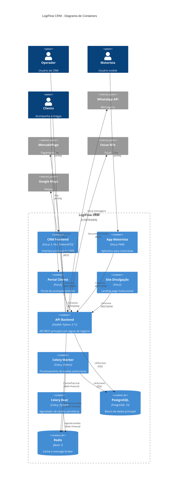
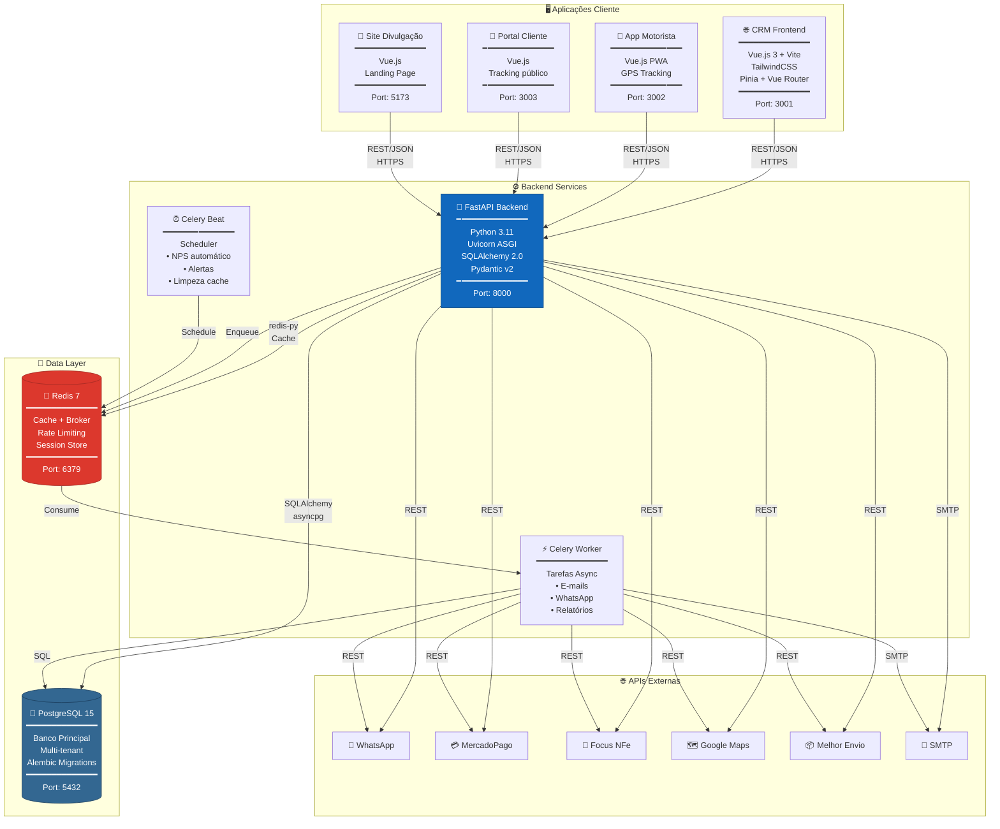
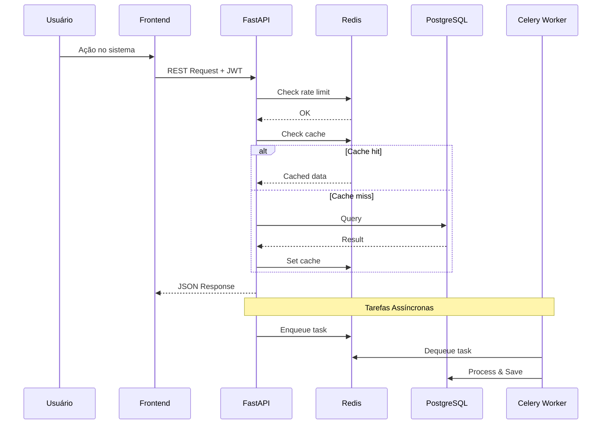

# LogiFlow CRM - C4 Model: Container Diagram (Nível 2)

> **Versão:** 1.0.0  
> **Atualizado:** Janeiro 2026

## Descrição

O Diagrama de Containers mostra os containers (aplicações, serviços, bancos de dados) que compõem o sistema LogiFlow CRM e como eles se comunicam.

---

## Diagrama Principal



---

## Visão Detalhada (Flowchart)



---

## Descrição dos Containers

### Aplicações Frontend

| Container | Tecnologia | Porta | Descrição |
|-----------|------------|-------|-----------|
| **CRM Frontend** | Vue.js 3, Vite, TailwindCSS | 3001 | Interface principal do CRM para operadores |
| **App Motorista** | Vue.js PWA | 3002 | Aplicativo progressivo para motoristas com GPS |
| **Portal Cliente** | Vue.js | 3003 | Portal de rastreamento para clientes finais |
| **Site Divulgação** | Vue.js | 5173 | Landing page institucional com formulário de contato |

### Serviços Backend

| Container | Tecnologia | Porta | Descrição |
|-----------|------------|-------|-----------|
| **API Backend** | FastAPI, Python 3.11, Uvicorn | 8000 | API REST principal com todas as regras de negócio |
| **Celery Worker** | Celery 5.3, Python | - | Processador de tarefas assíncronas (e-mails, WhatsApp) |
| **Celery Beat** | Celery Beat | - | Agendador de tarefas periódicas (NPS, alertas) |

### Data Stores

| Container | Tecnologia | Porta | Descrição |
|-----------|------------|-------|-----------|
| **PostgreSQL** | PostgreSQL 15 Alpine | 5432 | Banco de dados relacional principal |
| **Redis** | Redis 7 Alpine | 6379 | Cache, rate limiting e message broker |

---

## Comunicação Entre Containers

### Protocolos Internos

```
Frontend Apps → API Backend
├── Protocolo: HTTPS (REST)
├── Formato: JSON
├── Autenticação: JWT Bearer Token
└── Headers: X-Tenant-ID, X-Correlation-ID

API Backend → PostgreSQL
├── Protocolo: PostgreSQL Wire Protocol
├── Driver: asyncpg / psycopg2
├── Pool: SQLAlchemy connection pool
└── Isolation: Read Committed

API Backend → Redis
├── Protocolo: Redis Protocol
├── Driver: redis-py
├── Uso: Cache, Rate Limit, Pub/Sub
└── Databases: 0 (Celery), 1 (Cache)

Celery Worker ↔ Redis
├── Protocolo: Redis Protocol
├── Padrão: Producer/Consumer
└── Serialization: JSON
```

### Fluxo de Requisições



---

## Configuração Docker

### docker compose -f docker/docker-compose.yml (Resumo)

```yaml
services:
  db:           # PostgreSQL 15 Alpine
  redis:        # Redis 7 Alpine
  api:          # FastAPI Backend
  frontend:     # Vue.js CRM
  site:         # Vue.js Landing Page
  celery_worker: # Celery Worker
  celery_beat:  # Celery Beat Scheduler
  adminer:      # DB Admin (dev only)
```

### Volumes Persistentes

| Volume | Container | Caminho |
|--------|-----------|---------|
| `postgres_data` | db | `/var/lib/postgresql/data` |
| `redis_data` | redis | `/data` |
| `static_volume` | api | `/app/staticfiles` |
| `media_volume` | api | `/app/media` |

### Rede

```
Network: logiflow_network (bridge)
├── db (postgres)
├── redis
├── api
├── frontend
├── site
├── celery_worker
└── celery_beat
```

---

## Escalabilidade

### Horizontal Scaling

| Container | Escalável | Estratégia |
|-----------|-----------|------------|
| API Backend | ✅ Sim | Load Balancer + múltiplas instâncias |
| Celery Worker | ✅ Sim | Múltiplos workers por fila |
| Frontend | ✅ Sim | CDN + múltiplas instâncias |
| PostgreSQL | ⚠️ Limitado | Read replicas |
| Redis | ⚠️ Limitado | Redis Cluster |

### Resource Limits (Recomendado)

| Container | CPU | Memory |
|-----------|-----|--------|
| API | 1-2 cores | 512MB-1GB |
| Celery Worker | 0.5-1 core | 256MB-512MB |
| PostgreSQL | 2-4 cores | 2GB-4GB |
| Redis | 0.5 core | 256MB |
| Frontend | 0.25 core | 128MB |

---

## Health Checks

| Container | Endpoint/Comando | Intervalo |
|-----------|------------------|-----------|
| API | `GET /health` | 15s |
| PostgreSQL | `pg_isready` | 10s |
| Redis | `redis-cli ping` | 10s |
| Celery Worker | `celery inspect ping` | 30s |

---

*Documento parte da documentação arquitetural do LogiFlow CRM - Modelo C4*
