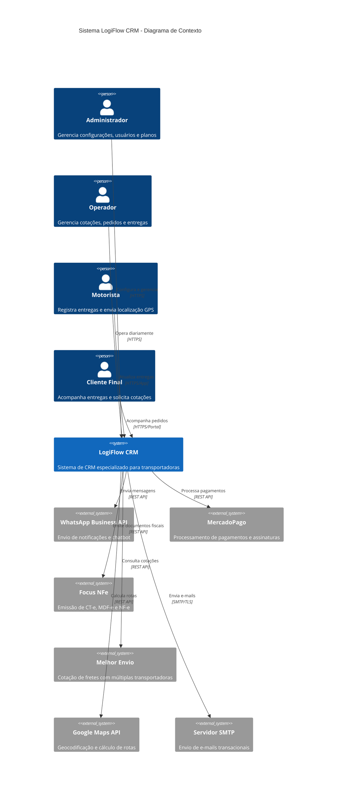
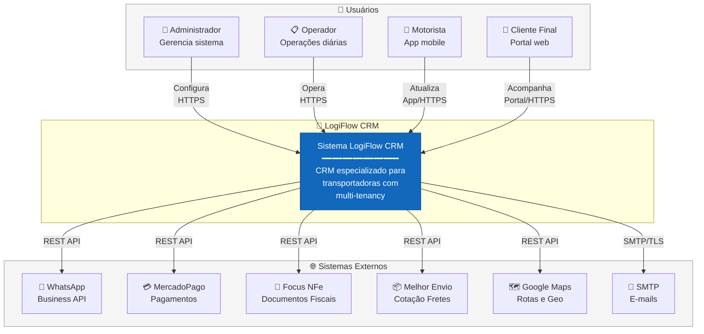

# LogiFlow CRM - C4 Model: Context Diagram (Nível 1)

> **Versão:** 1.0.0  
> **Atualizado:** Janeiro 2026

## Descrição

O Diagrama de Contexto mostra o sistema LogiFlow CRM e suas interações com usuários e sistemas externos. Este é o nível mais alto de abstração do C4 Model.

---

## Diagrama



---

## Visão Alternativa (Flowchart)



---

## Descrição dos Elementos

### Usuários (Pessoas)

| Ator | Descrição | Interação Principal |
|------|-----------|---------------------|
| **Administrador** | Responsável por configurar o sistema, gerenciar usuários, planos e integrações | Painel administrativo via web |
| **Operador** | Usuário do dia-a-dia que gerencia cotações, pedidos, entregas e clientes | CRM Frontend via web |
| **Motorista** | Profissional que realiza as entregas e reporta localização GPS | App mobile dedicado |
| **Cliente Final** | Pessoa física ou jurídica que acompanha suas entregas | Portal do cliente via web |

### Sistema Principal

| Sistema | Descrição | Tecnologias |
|---------|-----------|-------------|
| **LogiFlow CRM** | Sistema de CRM SaaS multi-tenant especializado para transportadoras e empresas de logística | FastAPI, Vue.js 3, PostgreSQL, Redis |

### Sistemas Externos

| Sistema | Propósito | Tipo de Integração |
|---------|-----------|-------------------|
| **WhatsApp Business API** | Envio de notificações automáticas, chatbot para atendimento | REST API (Evolution API) |
| **MercadoPago** | Processamento de pagamentos de assinaturas e checkout | REST API + Webhooks |
| **Focus NFe** | Emissão de documentos fiscais (CT-e, MDF-e, NF-e) | REST API |
| **Melhor Envio** | Cotação automática com múltiplas transportadoras | REST API |
| **Google Maps API** | Geocodificação de endereços e cálculo de rotas | REST API |
| **Servidor SMTP** | Envio de e-mails transacionais e notificações | SMTP com TLS |

---

## Fluxos de Comunicação

### Entrada de Dados
```
Usuários → LogiFlow CRM (HTTPS/REST)
├── Administrador: Configurações, usuários, planos
├── Operador: Cotações, pedidos, clientes
├── Motorista: Status entregas, localização GPS
└── Cliente: Solicitações, aprovações
```

### Saída para Sistemas Externos
```
LogiFlow CRM → Sistemas Externos (REST/SMTP)
├── WhatsApp: Notificações em tempo real
├── MercadoPago: Cobrança de assinaturas
├── Focus NFe: Emissão fiscal
├── Melhor Envio: Cotações de frete
├── Google Maps: Geocodificação
└── SMTP: E-mails transacionais
```

---

## Requisitos de Segurança

| Comunicação | Protocolo | Autenticação |
|-------------|-----------|--------------|
| Usuários → LogiFlow | HTTPS (TLS 1.3) | JWT Tokens |
| LogiFlow → WhatsApp | HTTPS | API Key |
| LogiFlow → MercadoPago | HTTPS | OAuth + Access Token |
| LogiFlow → Focus NFe | HTTPS | API Token |
| LogiFlow → Melhor Envio | HTTPS | Bearer Token |
| LogiFlow → Google Maps | HTTPS | API Key |
| LogiFlow → SMTP | SMTP/TLS | Username/Password |

---

## Observações

1. **Multi-Tenancy**: Cada transportadora (tenant) tem seus dados isolados
2. **SaaS Model**: Sistema oferecido como serviço com diferentes planos
3. **APIs RESTful**: Todas as integrações utilizam REST com JSON
4. **Webhooks**: MercadoPago utiliza webhooks para notificações de pagamento

---

*Documento parte da documentação arquitetural do LogiFlow CRM - Modelo C4*
