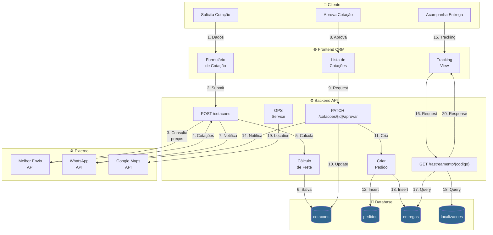
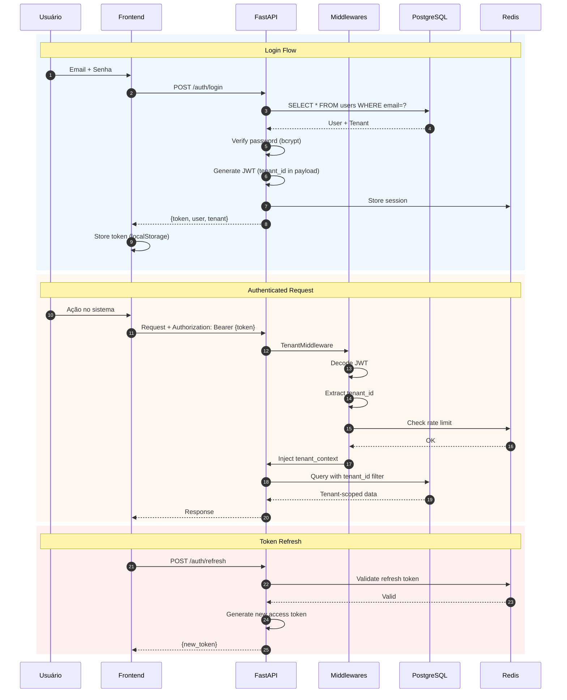
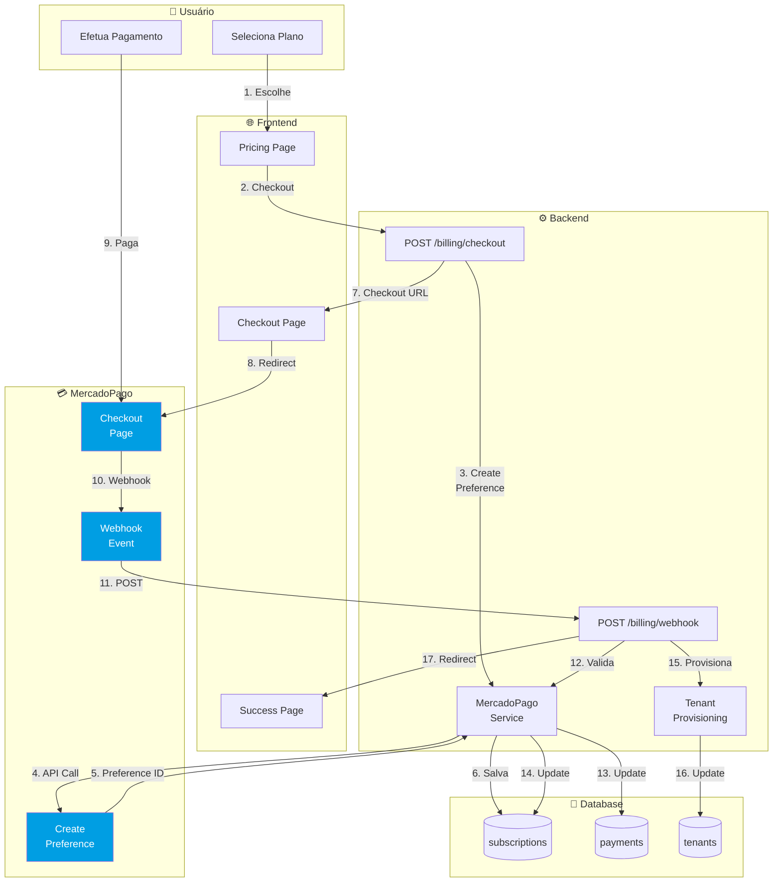
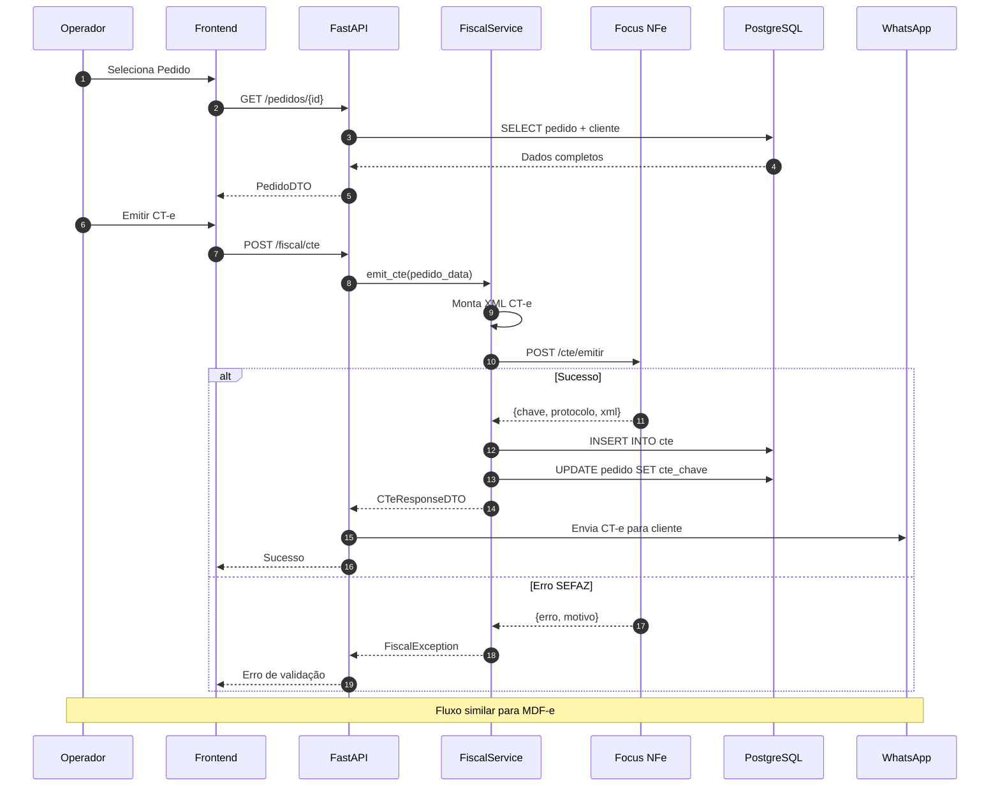
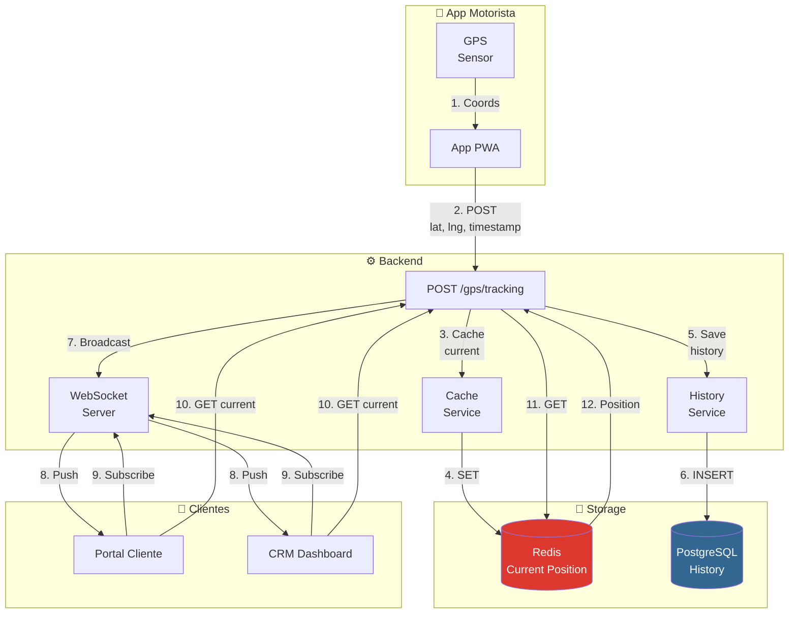
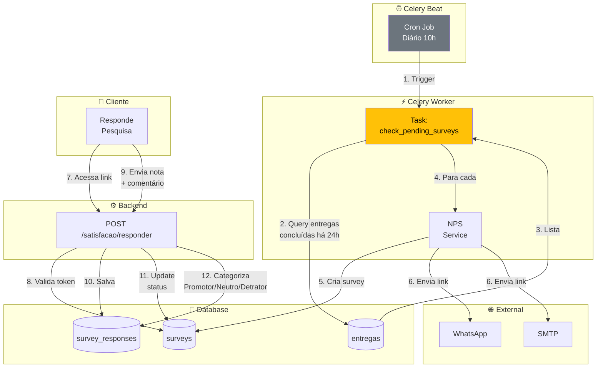
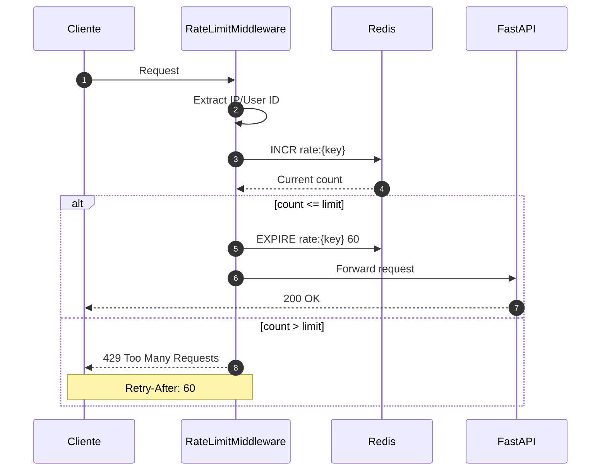
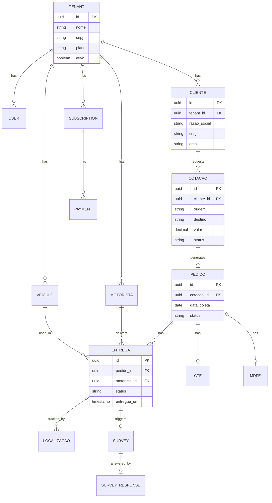

# LogiFlow CRM - Diagrama de Fluxo de Dados

> **Versão:** 1.0.0  
> **Atualizado:** Janeiro 2026

## Descrição

Este documento detalha os principais fluxos de dados do sistema LogiFlow CRM, mostrando como a informação transita entre os componentes.

---

## 1. Fluxo Principal: Cotação → Pedido → Entrega

---

## 2. Fluxo de Autenticação Multi-Tenant

---

## 3. Fluxo de Pagamento (MercadoPago)

---

## 4. Fluxo de Emissão Fiscal (CT-e)

---

## 5. Fluxo de GPS Tracking

---

## 6. Fluxo de Pesquisa NPS Automática

---

## 7. Fluxo de Rate Limiting

---

## 8. Diagrama de Entidade-Relacionamento (Simplificado)

---

## 9. Resumo dos Fluxos de Dados

| Fluxo | Origem | Destino | Trigger | Frequência |
|-------|--------|---------|---------|------------|
| Cotação | Cliente | PostgreSQL | User action | On-demand |
| Pedido | Cotação | PostgreSQL | Aprovação | On-demand |
| GPS | App Motorista | Redis + PG | Timer (30s) | Contínuo |
| Pagamento | MercadoPago | PostgreSQL | Webhook | On-demand |
| NPS | Celery Beat | Cliente | Cron | Diário |
| Fiscal | Operador | Focus NFe | User action | On-demand |
| Auth | User | Redis | Login | On-demand |

---

*Documento parte da documentação arquitetural do LogiFlow CRM*
