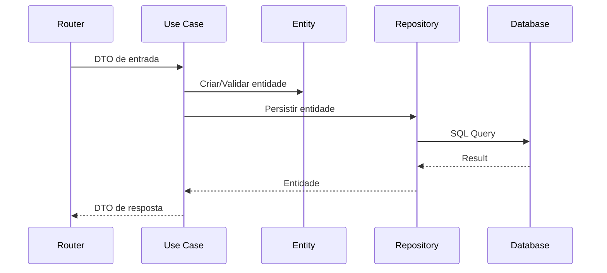

# LogiFlow CRM - Arquitetura em Camadas

## Visão Geral

O backend do LogiFlow CRM foi refatorado para seguir uma **arquitetura em camadas** inspirada em Clean Architecture e Domain-Driven Design (DDD).

```
┌─────────────────────────────────────────────────────────┐
│                    PRESENTATION                          │
│              (FastAPI Routers, Endpoints)               │
└─────────────────────────┬───────────────────────────────┘
                          │
┌─────────────────────────▼───────────────────────────────┐
│                    APPLICATION                           │
│           (Use Cases, DTOs, Services)                   │
└─────────────────────────┬───────────────────────────────┘
                          │
┌─────────────────────────▼───────────────────────────────┐
│                      DOMAIN                              │
│    (Entities, Value Objects, Interfaces, Exceptions)    │
└─────────────────────────┬───────────────────────────────┘
                          │
┌─────────────────────────▼───────────────────────────────┐
│                  INFRASTRUCTURE                          │
│     (Repositories, Persistence, External APIs)          │
└─────────────────────────────────────────────────────────┘
```

## Estrutura de Pastas

```
backend/
├── domain/                    # Camada de Domínio (núcleo)
│   ├── entities/              # Entidades de negócio
│   │   ├── base.py            # Classe base Entity
│   │   ├── cliente.py         # Entidade Cliente
│   │   ├── cotacao.py         # Entidade Cotação
│   │   └── pedido.py          # Entidade Pedido
│   ├── value_objects/         # Objetos de valor imutáveis
│   │   ├── endereco.py        # VO Endereço
│   │   └── documento.py       # VOs CNPJ e CPF
│   ├── interfaces/            # Contratos (abstrações)
│   │   └── repositories.py    # Interfaces dos repositories
│   └── exceptions/            # Exceções de domínio
│       └── domain_exceptions.py
│
├── application/               # Camada de Aplicação
│   ├── dtos/                  # Data Transfer Objects
│   │   ├── cliente_dto.py
│   │   ├── cotacao_dto.py
│   │   └── pedido_dto.py
│   └── use_cases/             # Casos de uso
│       ├── cliente_use_cases.py
│       └── cotacao_use_cases.py
│
├── infrastructure/            # Camada de Infraestrutura
│   ├── persistence/           # Persistência (SQLAlchemy)
│   │   ├── database.py        # Configuração do banco
│   │   └── models.py          # Modelos SQLAlchemy
│   ├── repositories/          # Implementações dos repos
│   │   ├── cliente_repository.py
│   │   ├── cotacao_repository.py
│   │   └── pedido_repository.py
│   └── container.py           # Dependency Injection
│
├── routers/                   # Camada de Apresentação (existente)
│   ├── clientes.py            # (migrar para usar use cases)
│   ├── cotacoes.py
│   └── pedidos.py
│
└── main.py                    # Entrypoint FastAPI
```

## Princípios Aplicados

### 1. Dependency Inversion
- Camadas internas (Domain) não dependem de externas
- Infrastructure implementa interfaces definidas em Domain
- Use Cases recebem repositories via injeção de dependência

### 2. Single Responsibility
- Cada classe/módulo tem uma única responsabilidade
- Use Cases orquestram uma operação específica
- Repositories abstraem acesso a dados

### 3. Interface Segregation
- Interfaces específicas para cada repository
- DTOs específicos para entrada (Create/Update) e saída (Response)

## Design Patterns Utilizados

| Pattern | Localização | Uso |
|---------|-------------|-----|
| **Repository** | `domain/interfaces/`, `infrastructure/repositories/` | Abstração de persistência |
| **DTO** | `application/dtos/` | Transferência de dados entre camadas |
| **Value Object** | `domain/value_objects/` | Objetos imutáveis (Endereço, CNPJ, CPF) |
| **Use Case** | `application/use_cases/` | Encapsulamento de regras de negócio |
| **Dependency Injection** | `infrastructure/container.py` | Inversão de controle |

## Fluxo de uma Requisição



## Exemplo de Uso

### Router (Presentation Layer)
```python
from fastapi import APIRouter, Depends
from sqlalchemy.orm import Session

from infrastructure.container import Container, get_db
from application.dtos import ClienteCreateDTO, ClienteResponseDTO
from application.use_cases import CriarClienteUseCase

router = APIRouter(prefix="/clientes", tags=["Clientes"])

@router.post("/", response_model=ClienteResponseDTO)
async def criar_cliente(
    dto: ClienteCreateDTO,
    db: Session = Depends(get_db)
):
    use_case = Container.criar_cliente_use_case(db)
    return await use_case.execute(dto)
```

## Próximos Passos

1. **Migrar routers existentes** para usar os novos Use Cases
2. **Adicionar testes unitários** para Use Cases e Entities
3. **Implementar validações** adicionais nos Value Objects
4. **Criar migrations** Alembic para os novos models
5. **Documentar APIs** com OpenAPI/Swagger

## Referências

- [Clean Architecture - Robert C. Martin](https://blog.cleancoder.com/uncle-bob/2012/08/13/the-clean-architecture.html)
- [ADR-004: Design Patterns](../adr/ADR-004-design-patterns.md)
- [ADR-005: Project Structure](../adr/ADR-005-project-structure.md)
