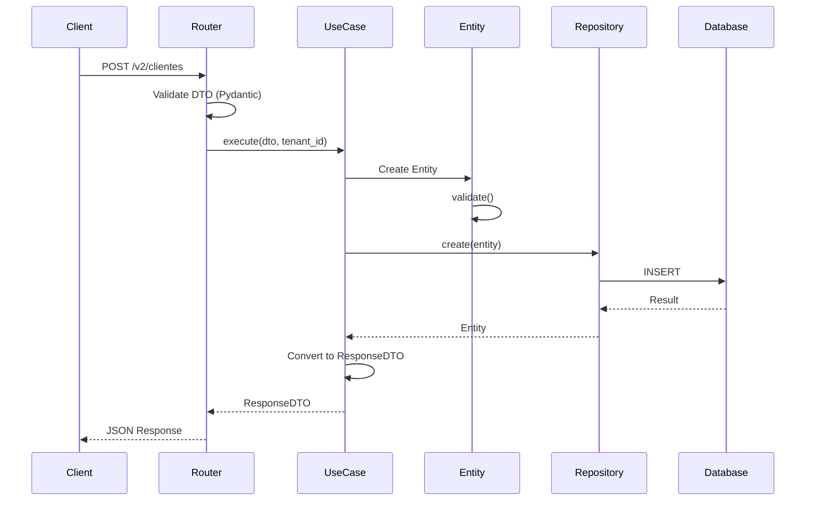

# LogiFlow CRM - Clean Architecture Layers

> **Versão:** 1.0.0  
> **Atualizado:** Janeiro 2026

## Visão Geral

O LogiFlow CRM implementa Clean Architecture com 4 camadas principais, seguindo a Dependency Rule onde dependências apontam para dentro (camadas internas não conhecem camadas externas).

```
┌──────────────────────────────────────────────────────────────────┐
│                       PRESENTATION                                │
│  Routers, Controllers, Middlewares, API Endpoints                │
├──────────────────────────────────────────────────────────────────┤
│                        APPLICATION                                │
│  Use Cases, DTOs, Application Services                           │
├──────────────────────────────────────────────────────────────────┤
│                          DOMAIN                                   │
│  Entities, Value Objects, Interfaces, Domain Services            │
├──────────────────────────────────────────────────────────────────┤
│                       INFRASTRUCTURE                              │
│  Repositories, External APIs, Database, Cache                    │
└──────────────────────────────────────────────────────────────────┘

Dependency Rule: ← ← ← (dependências apontam para o centro)
```

---

## 1. Domain Layer (Camada de Domínio)

**Localização:** `backend/domain/`

A camada mais interna, contém regras de negócio puras. **Não tem dependências externas.**

### Estrutura

```
domain/
├── __init__.py
├── entities/           # Entidades de negócio
│   ├── __init__.py
│   ├── base.py         # Entity base class
│   ├── cliente.py      # Cliente entity
│   ├── cotacao.py      # Cotacao entity
│   └── pedido.py       # Pedido entity
├── value_objects/      # Objetos de valor imutáveis
│   ├── __init__.py
│   ├── cnpj.py
│   ├── email.py
│   └── money.py
├── interfaces/         # Contratos (abstrações)
│   ├── __init__.py
│   └── repositories.py # IRepository interfaces
├── exceptions/         # Exceções de domínio
│   ├── __init__.py
│   └── domain_exceptions.py
└── factories/          # Factories de entidades
    ├── cotacao_factory.py
    └── pedido_factory.py
```

### Responsabilidades

| Componente | Responsabilidade |
|------------|------------------|
| **Entities** | Representam conceitos de negócio com identidade |
| **Value Objects** | Objetos imutáveis sem identidade (CNPJ, Email) |
| **Interfaces** | Contratos que a infraestrutura deve implementar |
| **Exceptions** | Erros específicos do domínio |
| **Factories** | Criação de entidades complexas |

### Exemplo: Entity

```python
# domain/entities/cliente.py
from dataclasses import dataclass
from typing import Optional
from datetime import datetime

@dataclass
class Cliente:
    """Entidade Cliente - representa uma empresa cliente."""
    
    id: Optional[str] = None
    cnpj: 'CNPJ' = None
    razao_social: str = ""
    email: Optional['Email'] = None
    telefone: Optional[str] = None
    endereco: Optional[str] = None
    tenant_id: str = ""
    ativo: bool = True
    created_at: Optional[datetime] = None
    updated_at: Optional[datetime] = None
    
    def validate(self) -> bool:
        """Valida regras de negócio da entidade."""
        if not self.cnpj or not self.cnpj.is_valid():
            raise ValueError("CNPJ inválido")
        if not self.razao_social or len(self.razao_social) < 2:
            raise ValueError("Razão social deve ter pelo menos 2 caracteres")
        if not self.tenant_id:
            raise ValueError("Tenant ID obrigatório")
        return True
    
    def desativar(self):
        """Desativa o cliente."""
        self.ativo = False
        self.updated_at = datetime.utcnow()
```

---

## 2. Application Layer (Camada de Aplicação)

**Localização:** `backend/application/`

Contém os casos de uso da aplicação. Orquestra o fluxo de dados entre camadas.

### Estrutura

```
application/
├── __init__.py
├── use_cases/          # Casos de uso (interactors)
│   ├── __init__.py
│   ├── cliente_use_cases.py
│   └── cotacao_use_cases.py
└── dtos/               # Data Transfer Objects
    ├── __init__.py
    ├── cliente_dto.py
    ├── cotacao_dto.py
    └── pedido_dto.py
```

### Responsabilidades

| Componente | Responsabilidade |
|------------|------------------|
| **Use Cases** | Implementam regras de aplicação, orquestram fluxos |
| **DTOs** | Transferência de dados entre camadas, validação |

### Exemplo: Use Case

```python
# application/use_cases/cliente_use_cases.py
from domain.interfaces.repositories import IClienteRepository
from domain.entities.cliente import Cliente
from domain.value_objects import CNPJ, Email
from application.dtos.cliente_dto import ClienteCreateDTO, ClienteResponseDTO


class CriarClienteUseCase:
    """Caso de uso: Criar novo cliente."""
    
    def __init__(self, repository: IClienteRepository):
        self.repository = repository
    
    def execute(self, dto: ClienteCreateDTO, tenant_id: str) -> ClienteResponseDTO:
        # 1. Verifica duplicidade
        existing = self.repository.get_by_cnpj(dto.cnpj, tenant_id)
        if existing:
            raise ValueError("CNPJ já cadastrado")
        
        # 2. Cria entidade de domínio
        cliente = Cliente(
            cnpj=CNPJ(dto.cnpj),
            razao_social=dto.razao_social,
            email=Email(dto.email) if dto.email else None,
            telefone=dto.telefone,
            tenant_id=tenant_id
        )
        
        # 3. Valida regras de negócio
        cliente.validate()
        
        # 4. Persiste via repository
        created = self.repository.create(cliente)
        
        # 5. Retorna DTO de resposta
        return ClienteResponseDTO.from_entity(created)
```

---

## 3. Infrastructure Layer (Camada de Infraestrutura)

**Localização:** `backend/infrastructure/`

Implementa interfaces definidas no domínio. Contém detalhes técnicos.

### Estrutura

```
infrastructure/
├── __init__.py
├── repositories/       # Implementações de repositórios
│   ├── __init__.py
│   ├── cliente_repository.py
│   ├── cotacao_repository.py
│   └── pedido_repository.py
├── persistence/        # Configuração de banco
│   ├── __init__.py
│   └── database.py
└── container.py        # DI Container
```

### Responsabilidades

| Componente | Responsabilidade |
|------------|------------------|
| **Repositories** | Implementam IRepository, acessam banco |
| **Persistence** | Configuração de conexão, sessões |
| **Container** | Dependency Injection, wiring |

### Exemplo: Repository

```python
# infrastructure/repositories/cliente_repository.py
from typing import List, Optional
from sqlalchemy.orm import Session

from domain.interfaces.repositories import IClienteRepository
from domain.entities.cliente import Cliente
from models import Cliente as ClienteModel


class ClienteRepository(IClienteRepository):
    """Implementação SQLAlchemy do repositório de clientes."""
    
    def __init__(self, db: Session):
        self.db = db
    
    def get_by_id(self, id: str) -> Optional[Cliente]:
        model = self.db.query(ClienteModel).filter_by(id=id).first()
        return self._to_entity(model) if model else None
    
    def create(self, entity: Cliente) -> Cliente:
        model = self._to_model(entity)
        self.db.add(model)
        self.db.commit()
        self.db.refresh(model)
        return self._to_entity(model)
    
    def _to_entity(self, model: ClienteModel) -> Cliente:
        """Converte Model para Entity."""
        return Cliente(
            id=model.id,
            cnpj=CNPJ(model.cnpj),
            razao_social=model.razao_social,
            tenant_id=model.tenant_id
        )
    
    def _to_model(self, entity: Cliente) -> ClienteModel:
        """Converte Entity para Model."""
        return ClienteModel(
            cnpj=str(entity.cnpj),
            razao_social=entity.razao_social,
            tenant_id=entity.tenant_id
        )
```

---

## 4. Presentation Layer (Camada de Apresentação)

**Localização:** `backend/presentation/` e `backend/routers/`

Interface com o mundo externo. Recebe requests, retorna responses.

### Estrutura

```
presentation/
├── __init__.py
└── api/                # Endpoints da API v2
    ├── __init__.py
    ├── clientes_router.py
    ├── cotacoes_router.py
    └── pedidos_router.py

routers/                # Endpoints legados (v1)
├── __init__.py
├── auth.py
├── billing.py
├── clientes.py
└── ... (32 routers)
```

### Responsabilidades

| Componente | Responsabilidade |
|------------|------------------|
| **Routers** | Endpoints HTTP, validação de request |
| **Middlewares** | CORS, Auth, Rate Limiting, Tenant |

### Exemplo: Router

```python
# presentation/api/clientes_router.py
from fastapi import APIRouter, Depends, HTTPException, status

from application.use_cases.cliente_use_cases import CriarClienteUseCase
from application.dtos.cliente_dto import ClienteCreateDTO, ClienteResponseDTO
from infrastructure.container import get_criar_cliente_use_case
from middleware.tenant import get_tenant_id

router = APIRouter(prefix="/v2/clientes", tags=["Clientes v2"])


@router.post("/", response_model=ClienteResponseDTO, status_code=201)
async def criar_cliente(
    dto: ClienteCreateDTO,
    use_case: CriarClienteUseCase = Depends(get_criar_cliente_use_case),
    tenant_id: str = Depends(get_tenant_id)
):
    """Cria um novo cliente."""
    try:
        return use_case.execute(dto, tenant_id)
    except ValueError as e:
        raise HTTPException(status_code=400, detail=str(e))
```

---

## Fluxo de uma Requisição



---

## Regras de Dependência

```
✅ PERMITIDO:
  Presentation → Application → Domain
  Infrastructure → Domain
  
❌ PROIBIDO:
  Domain → Application
  Domain → Infrastructure
  Domain → Presentation
  Application → Presentation
```

### Diagrama de Dependências

```
                    ┌─────────────────┐
                    │  Presentation   │
                    │    (Routers)    │
                    └────────┬────────┘
                             │ depends on
                             ▼
                    ┌─────────────────┐
                    │   Application   │
                    │   (Use Cases)   │
                    └────────┬────────┘
                             │ depends on
                             ▼
┌─────────────────┐ ┌─────────────────┐
│ Infrastructure  │ │     Domain      │
│ (Repositories)  │─│   (Entities)    │
└─────────────────┘ └─────────────────┘
        │                    ▲
        │    implements      │
        └────────────────────┘
```

---

## Checklist de Conformidade

| Regra | Status |
|-------|--------|
| Domain não importa de Infrastructure | ✅ |
| Domain não importa de Application | ✅ |
| Domain não importa de Presentation | ✅ |
| Use Cases dependem apenas de interfaces | ✅ |
| Repositories implementam interfaces do Domain | ✅ |
| DTOs são usados para transferência de dados | ✅ |

---

## Referências

- [Clean Architecture - Uncle Bob](https://blog.cleancoder.com/uncle-bob/2012/08/13/the-clean-architecture.html)
- [ADR-005 - Clean Architecture](../adr/ADR-005-clean-architecture.md)
