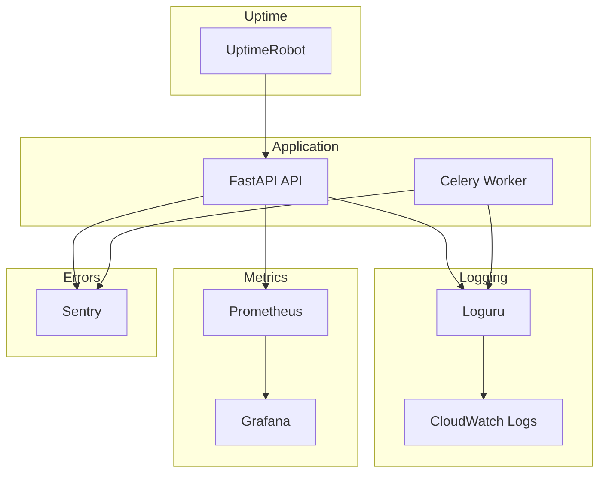

# LogiFlow CRM - Observability & Monitoring

## Visão Geral

O LogiFlow CRM implementa uma stack completa de observabilidade seguindo os três pilares:
- **Logs**: Registros estruturados de eventos
- **Métricas**: Dados numéricos sobre o comportamento do sistema
- **Traces**: Rastreamento de requisições entre serviços

## Arquitetura de Observabilidade



## 1. Logging

### Configuração (Loguru)

```python
# config.py
from loguru import logger
import sys

# Remove default handler
logger.remove()

# Console (desenvolvimento)
logger.add(
    sys.stdout,
    format="<green>{time:YYYY-MM-DD HH:mm:ss}</green> | <level>{level: <8}</level> | <cyan>{name}</cyan>:<cyan>{function}</cyan>:<cyan>{line}</cyan> - <level>{message}</level>",
    level="DEBUG" if settings.DEBUG else "INFO"
)

# Arquivo rotativo
logger.add(
    "logs/api_{time:YYYY-MM-DD}.log",
    rotation="00:00",     # Novo arquivo à meia-noite
    retention="30 days",  # Manter 30 dias
    compression="gz",     # Comprimir arquivos antigos
    level="INFO",
    format="{time:YYYY-MM-DD HH:mm:ss} | {level: <8} | {name}:{function}:{line} | {extra} | {message}"
)

# JSON para produção (CloudWatch/ELK)
logger.add(
    "logs/api.json",
    serialize=True,
    level="INFO"
)
```

### Níveis de Log

| Nível | Uso |
|-------|-----|
| `DEBUG` | Informações detalhadas para debugging |
| `INFO` | Eventos normais de operação |
| `WARNING` | Situações inesperadas mas não críticas |
| `ERROR` | Erros que impedem uma operação |
| `CRITICAL` | Erros graves que podem derrubar o sistema |

### Correlation ID

Cada requisição recebe um ID único para rastreamento:

```python
# middleware/correlation.py
import uuid
from contextvars import ContextVar

correlation_id: ContextVar[str] = ContextVar("correlation_id", default="")

@app.middleware("http")
async def correlation_middleware(request: Request, call_next):
    request_id = request.headers.get("X-Request-ID", str(uuid.uuid4()))
    correlation_id.set(request_id)
    
    with logger.contextualize(correlation_id=request_id):
        response = await call_next(request)
        response.headers["X-Request-ID"] = request_id
        return response
```

### Exemplo de Uso

```python
from loguru import logger

# Log simples
logger.info("Usuário autenticado", user_id=123)

# Log com contexto
logger.bind(tenant_id=1, user_id=123).info("Pedido criado", pedido_id=456)

# Log de erro com exception
try:
    processo_critico()
except Exception as e:
    logger.exception("Erro no processo crítico")
```

## 2. Métricas

### Prometheus Endpoint

```python
# routers/metrics.py
from prometheus_client import Counter, Histogram, generate_latest, CONTENT_TYPE_LATEST
from fastapi import APIRouter, Response

router = APIRouter()

# Métricas customizadas
REQUEST_COUNT = Counter(
    "logiflow_requests_total",
    "Total de requisições",
    ["method", "endpoint", "status"]
)

REQUEST_LATENCY = Histogram(
    "logiflow_request_latency_seconds",
    "Latência das requisições",
    ["method", "endpoint"],
    buckets=[0.01, 0.05, 0.1, 0.25, 0.5, 1.0, 2.5, 5.0]
)

ACTIVE_USERS = Counter(
    "logiflow_active_users",
    "Usuários ativos por tenant",
    ["tenant_id"]
)

@router.get("/metrics")
async def metrics():
    return Response(
        content=generate_latest(),
        media_type=CONTENT_TYPE_LATEST
    )
```

### Métricas de Negócio

| Métrica | Tipo | Descrição |
|---------|------|-----------|
| `logiflow_orders_total` | Counter | Total de pedidos criados |
| `logiflow_quotes_total` | Counter | Total de cotações geradas |
| `logiflow_deliveries_active` | Gauge | Entregas em andamento |
| `logiflow_billing_revenue` | Counter | Receita total por plano |

### Dashboard Grafana

Importar dashboards de `/monitoring/dashboards/`:

1. **API Overview** - Latência, throughput, erros
2. **Business Metrics** - Pedidos, clientes, faturamento
3. **Infrastructure** - CPU, memória, disco

## 3. Health Checks

### Endpoints

```python
# routers/health.py
from fastapi import APIRouter, Depends
from sqlalchemy.orm import Session

router = APIRouter()

@router.get("/health")
async def health():
    """Liveness probe - aplicação está rodando?"""
    return {"status": "ok", "timestamp": datetime.utcnow().isoformat()}

@router.get("/readiness")
async def readiness(db: Session = Depends(get_db)):
    """Readiness probe - aplicação está pronta para receber tráfego?"""
    checks = {
        "database": check_database(db),
        "redis": check_redis(),
        "external_apis": check_external_apis()
    }
    
    all_healthy = all(c["healthy"] for c in checks.values())
    
    return {
        "status": "ready" if all_healthy else "degraded",
        "checks": checks,
        "timestamp": datetime.utcnow().isoformat()
    }

def check_database(db):
    try:
        db.execute("SELECT 1")
        return {"healthy": True, "latency_ms": 1}
    except Exception as e:
        return {"healthy": False, "error": str(e)}

def check_redis():
    try:
        redis_client.ping()
        return {"healthy": True}
    except Exception as e:
        return {"healthy": False, "error": str(e)}
```

### Kubernetes Probes

```yaml
# k8s/deployment.yaml
livenessProbe:
  httpGet:
    path: /health
    port: 8000
  initialDelaySeconds: 10
  periodSeconds: 15
  failureThreshold: 3

readinessProbe:
  httpGet:
    path: /readiness
    port: 8000
  initialDelaySeconds: 5
  periodSeconds: 10
  failureThreshold: 3
```

## 4. Error Tracking (Sentry)

### Configuração

```python
# main.py
import sentry_sdk
from sentry_sdk.integrations.fastapi import FastApiIntegration
from sentry_sdk.integrations.sqlalchemy import SqlalchemyIntegration

sentry_sdk.init(
    dsn=settings.SENTRY_DSN,
    environment=settings.ENVIRONMENT,
    traces_sample_rate=0.1,  # 10% das transações
    profiles_sample_rate=0.1,
    integrations=[
        FastApiIntegration(transaction_style="endpoint"),
        SqlalchemyIntegration(),
    ],
    before_send=filter_sensitive_data,
)

def filter_sensitive_data(event, hint):
    """Remove dados sensíveis antes de enviar ao Sentry"""
    if "request" in event:
        headers = event["request"].get("headers", {})
        if "authorization" in headers:
            headers["authorization"] = "[FILTERED]"
    return event
```

### Captura Manual

```python
import sentry_sdk

# Capturar exceção
try:
    processo_arriscado()
except Exception as e:
    sentry_sdk.capture_exception(e)
    raise

# Capturar mensagem
sentry_sdk.capture_message("Usuário excedeu limite de quotas", level="warning")

# Adicionar contexto
with sentry_sdk.push_scope() as scope:
    scope.set_tag("tenant_id", tenant_id)
    scope.set_user({"id": user_id, "email": user_email})
    scope.set_extra("order_data", order_data)
    sentry_sdk.capture_exception(e)
```

## 5. Uptime Monitoring

### UptimeRobot Configuration

| Monitor | URL | Intervalo | Alerta |
|---------|-----|-----------|--------|
| API Health | `https://api.logiflow.com.br/health` | 5 min | Email, Slack |
| Frontend | `https://app.logiflow.com.br` | 5 min | Email, Slack |
| Staging | `https://staging-api.logiflow.com.br/health` | 15 min | Email |

### Status Page

URL Pública: `https://status.logiflow.com.br`

Serviços monitorados:
- API Principal
- Frontend
- Banco de Dados
- Integrações (WhatsApp, Pagamentos)

## 6. Alertas

### Configuração de Alertas

| Alerta | Condição | Severidade | Ação |
|--------|----------|------------|------|
| API Down | Health check falha 3x | Critical | PagerDuty + Slack |
| Error Rate > 5% | Erros/Total > 5% por 5min | High | Slack |
| Latency P99 > 2s | 99th percentile > 2000ms | Medium | Slack |
| Disk > 80% | Uso de disco > 80% | Medium | Email |
| Memory > 90% | Uso de memória > 90% | High | Slack |

### Slack Webhook

```python
# utils/alerts.py
import httpx

async def send_slack_alert(message: str, severity: str = "warning"):
    webhook_url = settings.SLACK_WEBHOOK_URL
    
    colors = {
        "info": "#36a64f",
        "warning": "#ff9800",
        "error": "#f44336",
        "critical": "#9c27b0"
    }
    
    payload = {
        "attachments": [{
            "color": colors.get(severity, "#808080"),
            "title": f"LogiFlow Alert - {severity.upper()}",
            "text": message,
            "footer": "LogiFlow Monitoring",
            "ts": int(time.time())
        }]
    }
    
    async with httpx.AsyncClient() as client:
        await client.post(webhook_url, json=payload)
```

## 7. Runbooks

### API Lenta

1. Verificar métricas de latência no Grafana
2. Identificar endpoints lentos
3. Verificar queries lentas no banco
4. Verificar rate limiting
5. Escalar horizontalmente se necessário

### Alta Taxa de Erros

1. Verificar Sentry para stack traces
2. Verificar logs com correlation ID
3. Identificar padrão (todos usuários? um tenant?)
4. Rollback se causado por deploy recente
5. Hotfix e novo deploy

### Banco de Dados Lento

1. Verificar conexões ativas
2. Identificar queries bloqueantes
3. Verificar índices faltando
4. Considerar read replicas
5. Otimizar queries problemáticas

## Checklist de Observabilidade

- [x] Logs estruturados com Loguru
- [x] Correlation ID em todas requisições
- [x] Health check endpoint
- [x] Readiness check endpoint
- [x] Métricas Prometheus
- [x] Sentry para error tracking
- [x] Uptime monitoring externo
- [ ] Dashboards Grafana (em progresso)
- [ ] Alertas automatizados (em progresso)
- [ ] Status page público (planejado)
