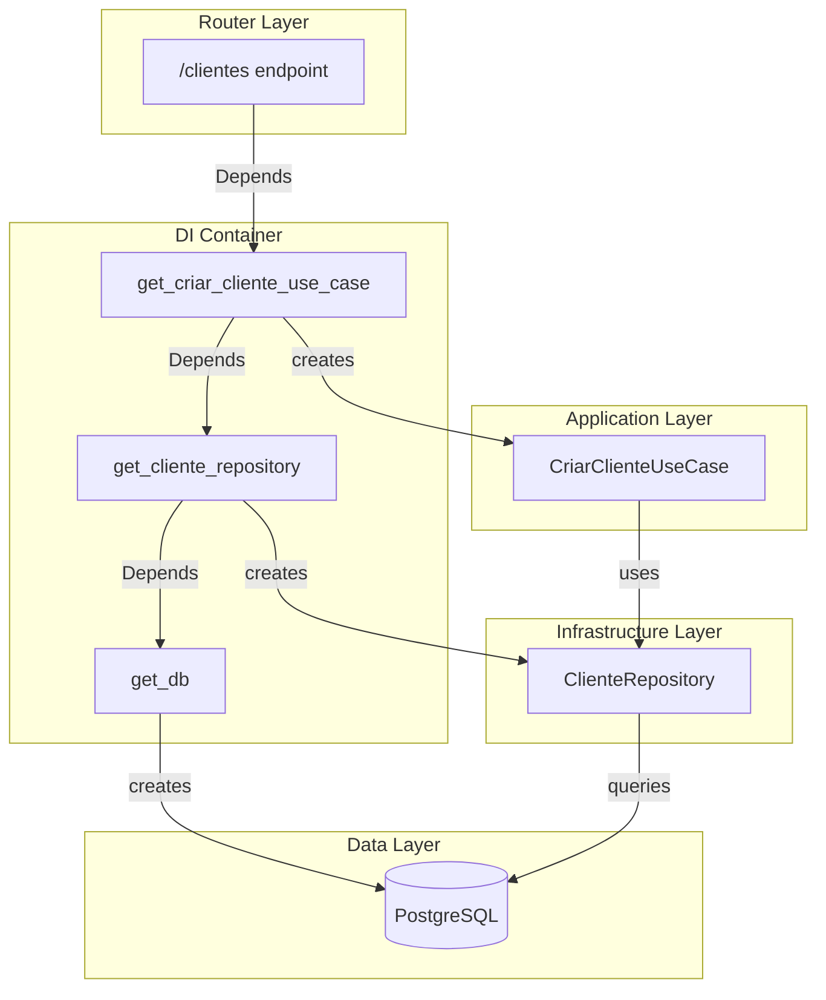

# Dependency Injection Pattern - LogiFlow CRM

> **Status:** Implementado  
> **Camada:** Infrastructure  
> **Arquivos:** `backend/infrastructure/container.py`

## O que é Dependency Injection?

Dependency Injection (DI) é um padrão onde as dependências de uma classe são fornecidas externamente, em vez de serem criadas internamente. Isso promove baixo acoplamento e alta testabilidade.

```
┌─────────────────────────────────────────────────────────────────┐
│                     SEM Dependency Injection                     │
├─────────────────────────────────────────────────────────────────┤
│  class UserService:                                              │
│      def __init__(self):                                         │
│          self.repo = UserRepository()  # ❌ Acoplado             │
│          self.db = Database()          # ❌ Difícil testar       │
└─────────────────────────────────────────────────────────────────┘

┌─────────────────────────────────────────────────────────────────┐
│                     COM Dependency Injection                     │
├─────────────────────────────────────────────────────────────────┤
│  class UserService:                                              │
│      def __init__(self, repo: IUserRepository):                  │
│          self.repo = repo              # ✅ Injetado             │
│                                        # ✅ Fácil testar         │
└─────────────────────────────────────────────────────────────────┘
```

## Por que usamos?

| Benefício | Descrição |
|-----------|-----------|
| **Testabilidade** | Injetar mocks/stubs facilmente |
| **Desacoplamento** | Classes não conhecem implementações concretas |
| **Flexibilidade** | Trocar implementações sem mudar código |
| **Single Responsibility** | Classes não criam suas dependências |
| **Configuração centralizada** | Container gerencia todas as dependências |

## Implementação no LogiFlow

### 1. DI Container (FastAPI Depends)

```python
# backend/infrastructure/container.py

from functools import lru_cache
from typing import Generator

from fastapi import Depends
from sqlalchemy.orm import Session

from domain.interfaces.repositories import (
    IClienteRepository,
    ICotacaoRepository,
    IPedidoRepository,
)
from application.use_cases.cliente_use_cases import (
    CriarClienteUseCase,
    AtualizarClienteUseCase,
    BuscarClienteUseCase,
    ListarClientesUseCase,
)
from application.use_cases.cotacao_use_cases import (
    CriarCotacaoUseCase,
    EnviarCotacaoUseCase,
    AprovarCotacaoUseCase,
)

from .persistence.database import SessionLocal
from .repositories.cliente_repository import ClienteRepository
from .repositories.cotacao_repository import CotacaoRepository
from .repositories.pedido_repository import PedidoRepository


# ========================================
# Database Session
# ========================================

def get_db() -> Generator[Session, None, None]:
    """
    Dependency: Fornece sessão do banco de dados.
    
    Uso:
        @router.get("/")
        async def list_items(db: Session = Depends(get_db)):
            ...
    """
    db = SessionLocal()
    try:
        yield db
    finally:
        db.close()


# ========================================
# Repository Dependencies
# ========================================

def get_cliente_repository(db: Session = Depends(get_db)) -> IClienteRepository:
    """Dependency: Fornece repository de clientes."""
    return ClienteRepository(db)


def get_cotacao_repository(db: Session = Depends(get_db)) -> ICotacaoRepository:
    """Dependency: Fornece repository de cotações."""
    return CotacaoRepository(db)


def get_pedido_repository(db: Session = Depends(get_db)) -> IPedidoRepository:
    """Dependency: Fornece repository de pedidos."""
    return PedidoRepository(db)


# ========================================
# Use Case Dependencies
# ========================================

def get_criar_cliente_use_case(
    repo: IClienteRepository = Depends(get_cliente_repository)
) -> CriarClienteUseCase:
    """Dependency: Fornece use case para criar cliente."""
    return CriarClienteUseCase(repo)


def get_listar_clientes_use_case(
    repo: IClienteRepository = Depends(get_cliente_repository)
) -> ListarClientesUseCase:
    """Dependency: Fornece use case para listar clientes."""
    return ListarClientesUseCase(repo)


def get_criar_cotacao_use_case(
    cotacao_repo: ICotacaoRepository = Depends(get_cotacao_repository),
    cliente_repo: IClienteRepository = Depends(get_cliente_repository)
) -> CriarCotacaoUseCase:
    """Dependency: Fornece use case para criar cotação."""
    return CriarCotacaoUseCase(cotacao_repo, cliente_repo)


def get_aprovar_cotacao_use_case(
    cotacao_repo: ICotacaoRepository = Depends(get_cotacao_repository),
    pedido_repo: IPedidoRepository = Depends(get_pedido_repository)
) -> AprovarCotacaoUseCase:
    """Dependency: Fornece use case para aprovar cotação."""
    return AprovarCotacaoUseCase(cotacao_repo, pedido_repo)
```

### 2. Container Class (Alternativa)

```python
# backend/infrastructure/container.py

class Container:
    """
    Container de Dependências centralizado.
    
    Uso em routers FastAPI:
        from infrastructure.container import Container
        
        @router.post("/clientes")
        async def criar_cliente(
            dto: ClienteCreateDTO,
            use_case: CriarClienteUseCase = Depends(Container.criar_cliente_use_case)
        ):
            return await use_case.execute(dto)
    """
    
    @staticmethod
    def db() -> Generator[Session, None, None]:
        return get_db()
    
    @staticmethod
    def cliente_repository(db: Session = Depends(get_db)) -> IClienteRepository:
        return ClienteRepository(db)
    
    @staticmethod
    def criar_cliente_use_case(
        db: Session = Depends(get_db)
    ) -> CriarClienteUseCase:
        repo = ClienteRepository(db)
        return CriarClienteUseCase(repo)
    
    @staticmethod
    def criar_cotacao_use_case(
        db: Session = Depends(get_db)
    ) -> CriarCotacaoUseCase:
        cotacao_repo = CotacaoRepository(db)
        cliente_repo = ClienteRepository(db)
        return CriarCotacaoUseCase(cotacao_repo, cliente_repo)
```

### 3. Uso nos Routers

```python
# backend/presentation/api/clientes_router.py

from fastapi import APIRouter, Depends, HTTPException, status
from typing import List

from application.use_cases.cliente_use_cases import (
    CriarClienteUseCase,
    ListarClientesUseCase,
)
from application.dtos.cliente_dto import (
    ClienteCreateDTO,
    ClienteResponseDTO,
    ClienteListDTO,
)
from infrastructure.container import (
    get_criar_cliente_use_case,
    get_listar_clientes_use_case,
)
from middleware.tenant import get_tenant_id

router = APIRouter(prefix="/v2/clientes", tags=["Clientes v2"])


@router.post(
    "/",
    response_model=ClienteResponseDTO,
    status_code=status.HTTP_201_CREATED
)
async def criar_cliente(
    dto: ClienteCreateDTO,
    use_case: CriarClienteUseCase = Depends(get_criar_cliente_use_case),
    tenant_id: str = Depends(get_tenant_id)
):
    """
    Cria um novo cliente.
    
    - **cnpj**: CNPJ válido do cliente
    - **razao_social**: Nome da empresa
    - **email**: Email de contato (opcional)
    """
    try:
        return use_case.execute(dto, tenant_id)
    except ValueError as e:
        raise HTTPException(
            status_code=status.HTTP_400_BAD_REQUEST,
            detail=str(e)
        )


@router.get("/", response_model=ClienteListDTO)
async def listar_clientes(
    skip: int = 0,
    limit: int = 100,
    use_case: ListarClientesUseCase = Depends(get_listar_clientes_use_case),
    tenant_id: str = Depends(get_tenant_id)
):
    """Lista clientes do tenant com paginação."""
    return use_case.execute(tenant_id, skip, limit)
```

### 4. Dependências Aninhadas

```python
# Exemplo de dependência que usa outras dependências

from fastapi import Depends
from services.email_service import EmailService
from services.notification_service import NotificationService

def get_email_service() -> EmailService:
    """Dependency: Email service."""
    return EmailService(
        smtp_host=settings.SMTP_HOST,
        smtp_port=settings.SMTP_PORT
    )

def get_notification_service(
    email: EmailService = Depends(get_email_service),
    whatsapp: WhatsAppService = Depends(get_whatsapp_service)
) -> NotificationService:
    """Dependency: Notification service com múltiplas dependências."""
    return NotificationService(email, whatsapp)


# No router
@router.post("/notify")
async def send_notification(
    data: NotificationDTO,
    service: NotificationService = Depends(get_notification_service)
):
    return service.send(data)
```

## Diagrama de Dependências



## Testes com Override de Dependências

```python
# backend/tests/conftest.py

import pytest
from fastapi.testclient import TestClient
from sqlalchemy import create_engine
from sqlalchemy.orm import sessionmaker

from main import app
from infrastructure.container import get_db
from database import Base

# Database de teste em memória
SQLALCHEMY_DATABASE_URL = "sqlite:///./test.db"
engine = create_engine(SQLALCHEMY_DATABASE_URL)
TestingSessionLocal = sessionmaker(bind=engine)


def override_get_db():
    """Override da dependência get_db para testes."""
    db = TestingSessionLocal()
    try:
        yield db
    finally:
        db.close()


@pytest.fixture
def client():
    """Fixture: Cliente de teste com DB override."""
    Base.metadata.create_all(bind=engine)
    
    # Override da dependência
    app.dependency_overrides[get_db] = override_get_db
    
    with TestClient(app) as c:
        yield c
    
    # Cleanup
    app.dependency_overrides.clear()
    Base.metadata.drop_all(bind=engine)


@pytest.fixture
def mock_cliente_repository():
    """Fixture: Mock do repositório para unit tests."""
    from unittest.mock import Mock
    from domain.interfaces.repositories import IClienteRepository
    return Mock(spec=IClienteRepository)
```

```python
# backend/tests/integration/test_clientes_api.py

def test_criar_cliente_success(client):
    response = client.post(
        "/v2/clientes/",
        json={
            "cnpj": "12345678000190",
            "razao_social": "Empresa Teste LTDA",
            "email": "contato@empresa.com"
        },
        headers={"Authorization": "Bearer test-token"}
    )
    
    assert response.status_code == 201
    assert response.json()["razao_social"] == "Empresa Teste LTDA"


def test_criar_cliente_cnpj_invalido(client):
    response = client.post(
        "/v2/clientes/",
        json={
            "cnpj": "invalid",
            "razao_social": "Teste"
        },
        headers={"Authorization": "Bearer test-token"}
    )
    
    assert response.status_code == 400
```

## Boas Práticas

### ✅ Faça

1. **Injete interfaces, não implementações**
   ```python
   def get_use_case(repo: IClienteRepository):  # ✅
       return UseCase(repo)
   ```

2. **Use funções de factory no container**
   ```python
   def get_service() -> IService:
       return ConcreteService()
   ```

3. **Mantenha dependências documentadas**
   ```python
   def get_service() -> IService:
       """
       Dependency: Fornece serviço X.
       
       Requer: Redis, Database
       """
   ```

### ❌ Evite

1. **Criar dependências dentro de classes**
   ```python
   class Service:
       def __init__(self):
           self.repo = Repository()  # ❌
   ```

2. **Dependências circulares**
   ```python
   def get_a(b = Depends(get_b)): ...
   def get_b(a = Depends(get_a)): ...  # ❌
   ```

3. **Dependências com side effects no import**
   ```python
   db = Database()  # ❌ Executa no import
   ```

## Referências

- [FastAPI Dependencies](https://fastapi.tiangolo.com/tutorial/dependencies/)
- [Dependency Injection - Martin Fowler](https://martinfowler.com/articles/injection.html)
- [Clean Architecture - Dependencies Rule](https://blog.cleancoder.com/uncle-bob/2012/08/13/the-clean-architecture.html)
