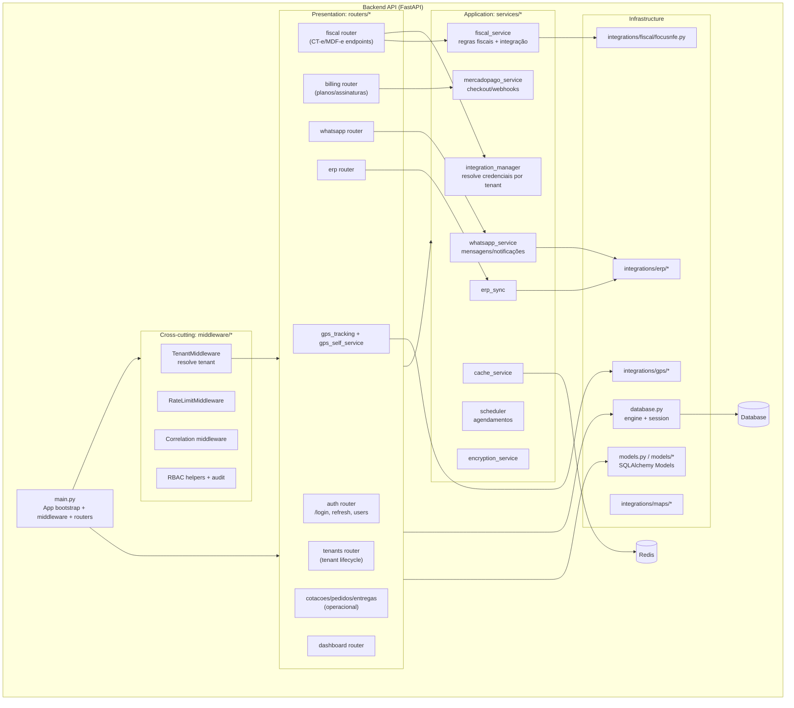

# C4 - Component Diagram (Nível 3)

## Backend API (FastAPI)

## Observações

- Os componentes acima representam a **estrutura real atual** (módulos existentes no repositório).
- Alguns routers ainda possuem lógica e persistência “simulada” em memória; isso será alvo de refatoração nas próximas fases.
