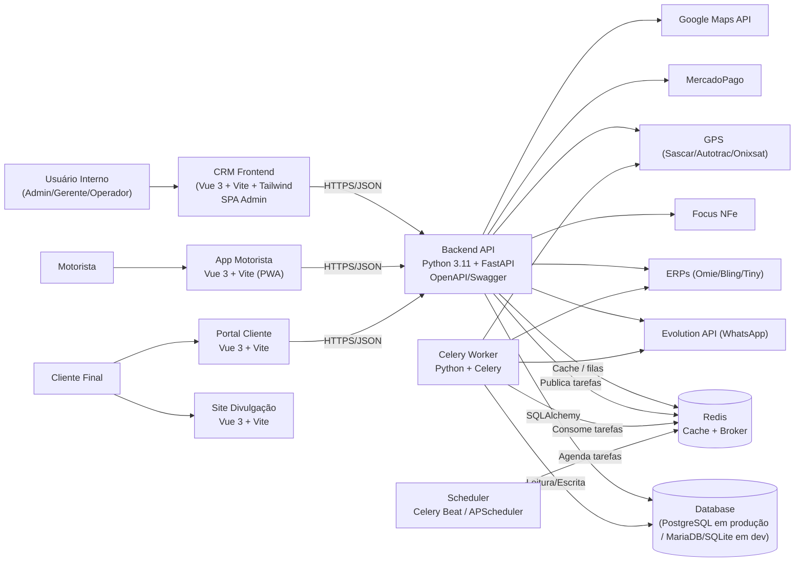

# C4 - Container Diagram (Nível 2)

```mermaid
flowchart LR
  %% Pessoas
  user_admin["Usuário Interno\n(Admin/Gerente/Operador)"]
  user_motorista["Motorista"]
  user_cliente["Cliente Final"]

  %% Containers
  crm_frontend["CRM Frontend\n(Vue 3 + Vite + Tailwind\nSPA Admin"]
  motorista_pwa["App Motorista\nVue 3 + Vite (PWA)"]
  portal_cliente["Portal Cliente\nVue 3 + Vite"]
  site_divulgacao["Site Divulgação\nVue 3 + Vite"]

  api["Backend API\nPython 3.11 + FastAPI\nOpenAPI/Swagger"]

  db[("Database\n(PostgreSQL em produção / MariaDB/SQLite em dev)")]
  redis[("Redis\nCache + Broker")]

  worker["Celery Worker\nPython + Celery"]
  beat["Scheduler\nCelery Beat / APScheduler"]

  %% Externos
  focusnfe["Focus NFe"]
  mercadopago["MercadoPago"]
  evolution["Evolution API (WhatsApp)"]
  erps["ERPs (Omie/Bling/Tiny)"]
  gps["GPS (Sascar/Autotrac/Onixsat)"]
  maps["Google Maps API"]

  %% Usuários -> frontends
  user_admin --> crm_frontend
  user_motorista --> motorista_pwa
  user_cliente --> portal_cliente
  user_cliente --> site_divulgacao

  %% Frontends -> API
  crm_frontend -->|"HTTPS/JSON"| api
  motorista_pwa -->|"HTTPS/JSON"| api
  portal_cliente -->|"HTTPS/JSON"| api

  %% API -> infra
  api -->|"SQLAlchemy"| db
  api -->|"Cache / filas"| redis

  %% Async
  api -->|"Publica tarefas"| redis
  worker -->|"Consome tarefas"| redis
  beat -->|"Agenda tarefas"| redis
  worker -->|"Leitura/Escrita"| db

  %% Integrações
  api --> focusnfe
  api --> mercadopago
  api --> evolution
  api --> erps
  api --> gps
  api --> maps

  worker --> evolution
  worker --> erps
  worker --> gps
```
