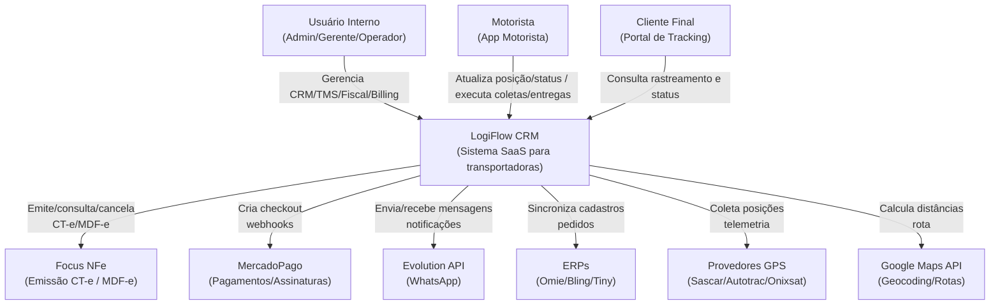

# C4 - Context Diagram (Nível 1)

```mermaid
flowchart TB
  %% Pessoas
  user_admin["Usuário Interno\n(Admin/Gerente/Operador)"]
  user_motorista["Motorista\n(App Motorista)"]
  user_cliente["Cliente Final\n(Portal de Tracking)"]

  %% Sistema
  system["LogiFlow CRM\n(Sistema SaaS para transportadoras)"]

  %% Sistemas externos
  focusnfe["Focus NFe\n(Emissão CT-e / MDF-e)"]
  mercadopago["MercadoPago\n(Pagamentos/Assinaturas)"]
  evolution["Evolution API\n(WhatsApp)"]
  erps["ERPs\n(Omie/Bling/Tiny)"]
  gps["Provedores GPS\n(Sascar/Autotrac/Onixsat)"]
  maps["Google Maps API\n(Geocoding/Rotas)"]

  %% Relações usuário -> sistema
  user_admin -->|"Gerencia CRM/TMS/Fiscal/Billing"| system
  user_motorista -->|"Atualiza posição/status / executa coletas/entregas"| system
  user_cliente -->|"Consulta rastreamento e status"| system

  %% Relações sistema -> externos
  system -->|"Emite/consulta/cancela\nCT-e/MDF-e"| focusnfe
  system -->|"Cria checkout\nwebhooks"| mercadopago
  system -->|"Envia/recebe mensagens\nnotificações"| evolution
  system -->|"Sincroniza cadastros\npedidos"| erps
  system -->|"Coleta posições\ntelemetria"| gps
  system -->|"Calcula distâncias\nrota"| maps
```
