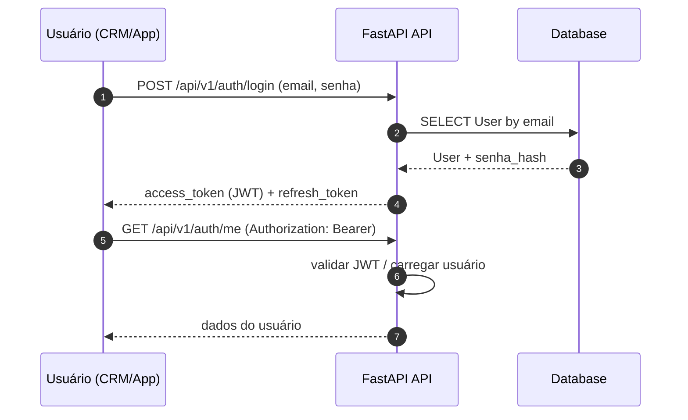
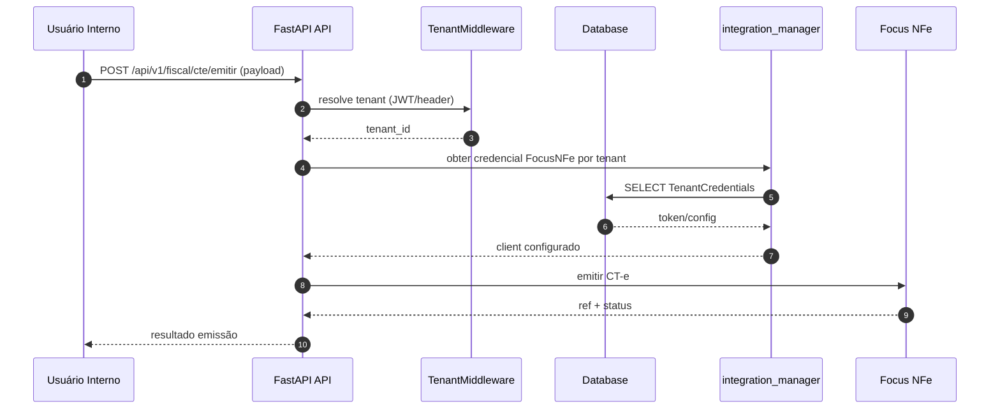
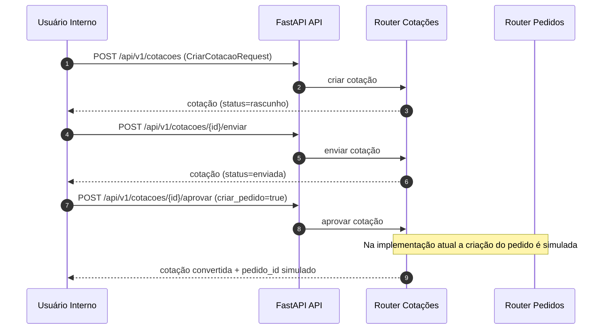
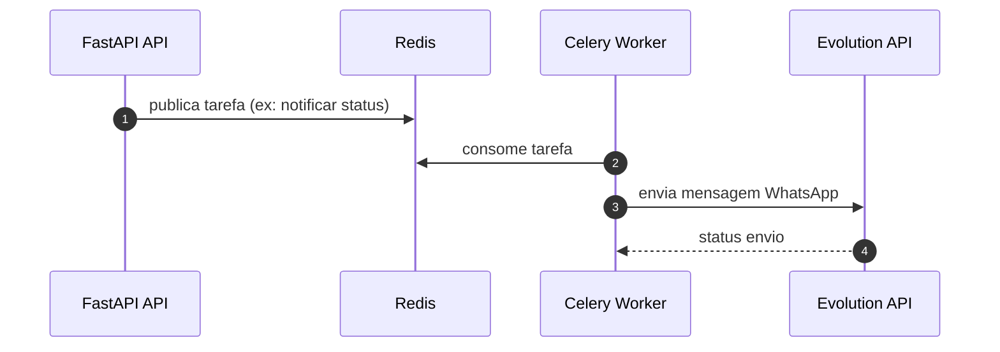

# Diagrama de Fluxo de Dados (Data Flow)

## 1) Autenticação (login + uso de token)

## 2) Emissão de CT-e (Fiscal)

## 3) Cotação -> Pedido (fluxo operacional atual)

## 4) Notificações assíncronas (Celery)

